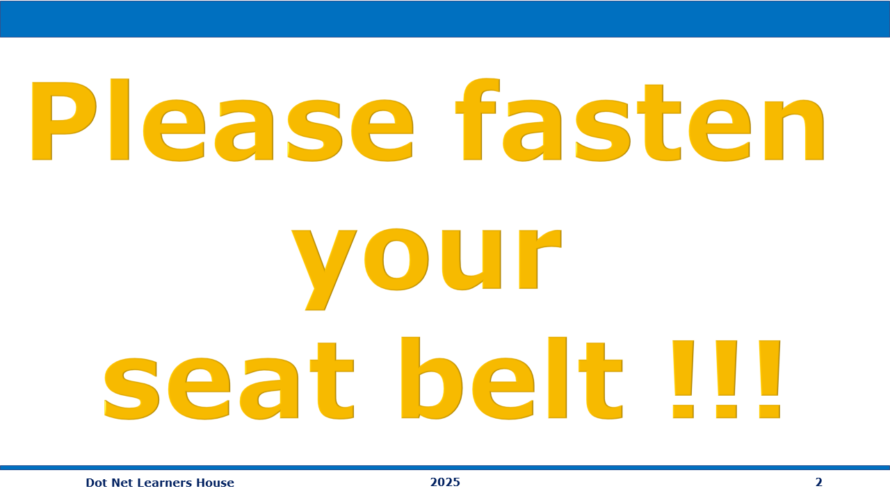

# .NET 9 Aspire - Local development with Docker, and Podman

## Date Time: 06-Oct-2024 at 09:00 AM IST

## Event URL: [https://www.meetup.com/dot-net-learners-house-hyderabad/events/302915015](https://www.meetup.com/dot-net-learners-house-hyderabad/events/302915015)

## YouTube URL: [https://www.youtube.com/watch?v=aV-e4CFMT_w](https://www.youtube.com/watch?v=aV-e4CFMT_w)

---

### Software/Tools

> 1. OS: Windows 10/11 x64
> 1. .NET 8 / AZ CLI / AZD CLI
> 1. Visual Studio 2022
> 1. Visual Studio Code

### Prior Knowledge

> 1. Programming knowledge in C#
> 1. Microservices / Distributed applications

## Technology Stack

> 1. .NET 8, C#, Docker

## Information


## What are we doing today?

> 1. The Big Picture
> 1. SUMMARY / RECAP / Q&A

### Please refer to the [**Source Code**](https://github.com/vishipayyallore/learn-aspire-2025) of today's session for more details

---



---

## 1. The Big Picture

> 1. Discussion and Demo

## .NET Aspire overview

> 1. Discussion and Demo
> 1. <https://learn.microsoft.com/en-us/dotnet/aspire/get-started/aspire-overview>

## Setup and tooling

> 1. Discussion and Demo
> 1. <https://learn.microsoft.com/en-us/dotnet/aspire/fundamentals/setup-tooling>

```powershell
dotnet workload list
dotnet workload update
dotnet workload install aspire
```

## .NET Aspire solution - Web API Project + Blazor Frontend + Cache (Docker Container)

> 1. Discussion and Demo
> 1. <https://learn.microsoft.com/en-us/dotnet/aspire/get-started/aspire-overview>
> 1. <https://learn.microsoft.com/en-us/dotnet/aspire/get-started/build-your-first-aspire-app?pivots=visual-studio>
> 1. <https://learn.microsoft.com/en-us/dotnet/aspire/get-started/build-your-first-aspire-app?pivots=vscode>

```powershell
dotnet workload list
dotnet new list
dotnet new aspire-starter --help
dotnet new aspire-starter -o AspireSample --use-redis-cache -f net9.0
```


## Orchestration overview

> 1. Discussion and Demo
> 1. <https://learn.microsoft.com/en-us/dotnet/aspire/fundamentals/app-host-overview>

## Service defaults

> 1. Discussion and Demo
> 1. <https://learn.microsoft.com/en-us/dotnet/aspire/fundamentals/service-defaults>

## Launch profiles

> 1. Discussion and Demo
> 1. <https://learn.microsoft.com/en-us/dotnet/aspire/fundamentals/launch-profiles>

## Service discovery

> 1. Discussion and Demo


## Containers with Docker and Podman

### Container in Docker


### Container in Podman


## Dashboard overview

> 1. Discussion and Demo


## SUMMARY / RECAP / Q&A

> 1. SUMMARY / RECAP / Q&A

---
