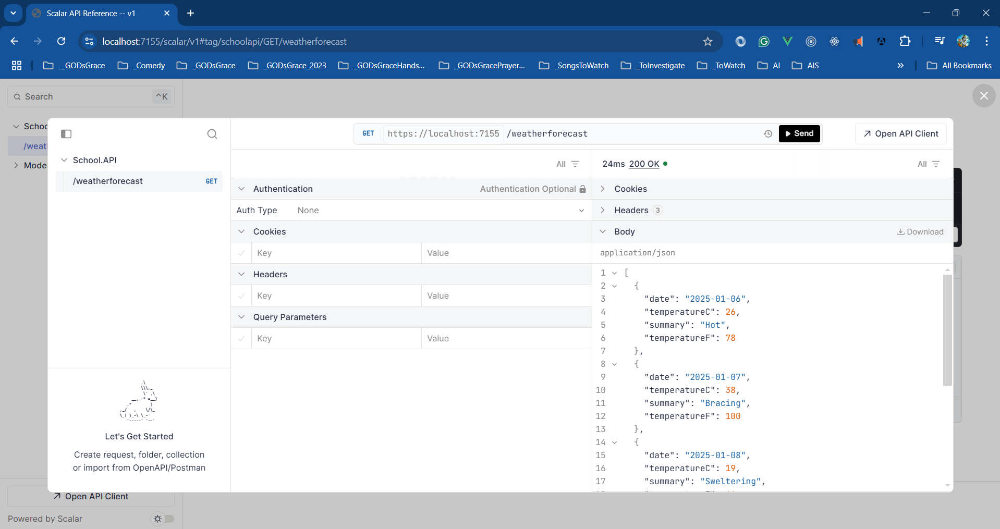

# .NET Conf 2024 - Dot Net Learners House Hyderabad

## Date Time: 19-Jan-2025 at 09:00 AM IST

## Event URL: [https://www.meetup.com/dot-net-learners-house-hyderabad/events/303337086](https://www.meetup.com/dot-net-learners-house-hyderabad/events/303337086)

## YouTube URL: [https://www.youtube.com/watch?v=aV-e4CFMT_w](https://www.youtube.com/watch?v=aV-e4CFMT_w)

---

### Software/Tools

> 1. OS: Windows 10/11 x64
> 1. .NET 8 / AZ CLI / AZD CLI
> 1. Visual Studio 2022
> 1. Visual Studio Code

### Prior Knowledge

> 1. Programming knowledge in C#
> 1. Microservices / Distributed applications

## Technology Stack

> 1. .NET 8, C#, Docker

## Information

## What are we doing today?

> 1. OpenAPI support in ASP.NET Core API
> 1. SUMMARY / RECAP / Q&A

### Please refer to the [**Source Code**](https://github.com/vishipayyallore/learn-aspire-2025) of today's session for more details

---

---

## 1. OpenAPI support in ASP.NET Core API

> 1. Discussion and Demo
> 1. <https://learn.microsoft.com/en-us/aspnet/core/fundamentals/openapi/overview?view=aspnetcore-9.0>

## SUMMARY / RECAP / Q&A

> 1. SUMMARY / RECAP / Q&A

---
