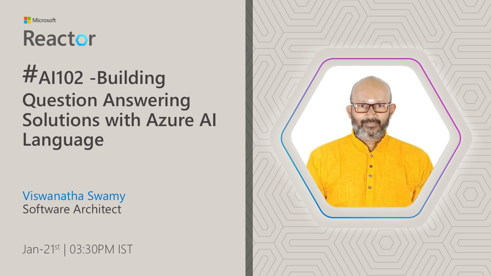
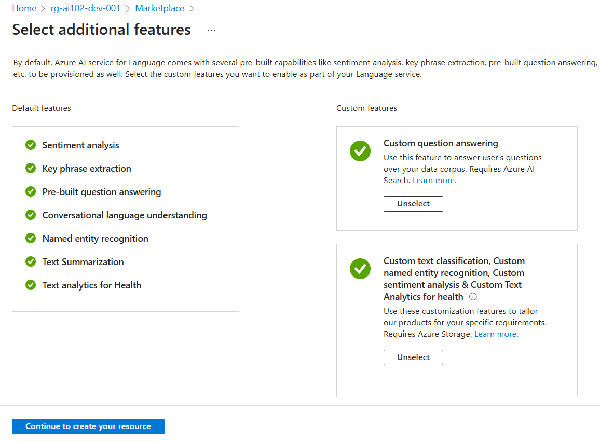
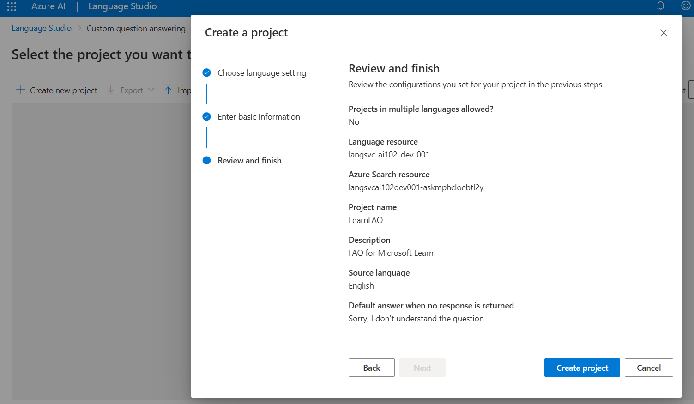
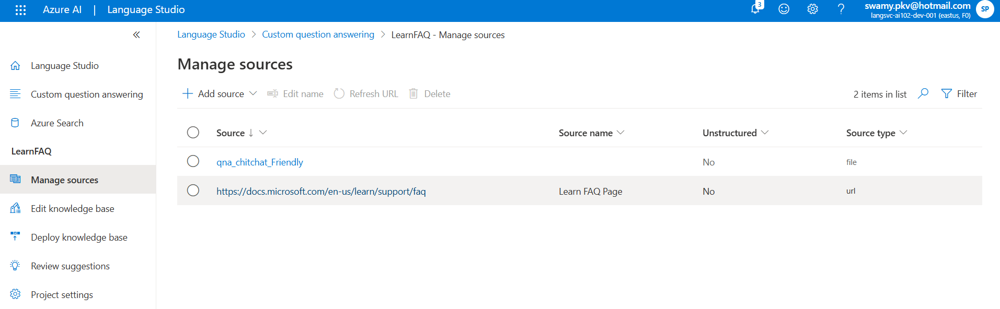
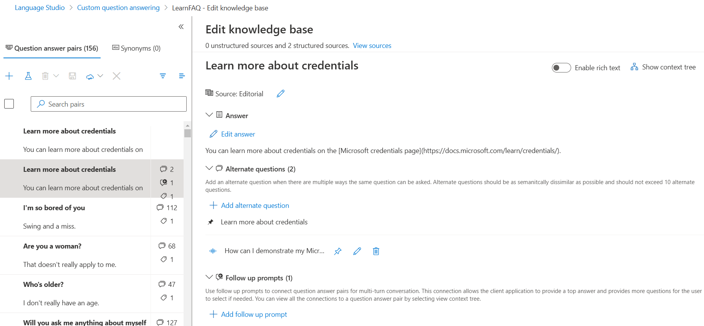
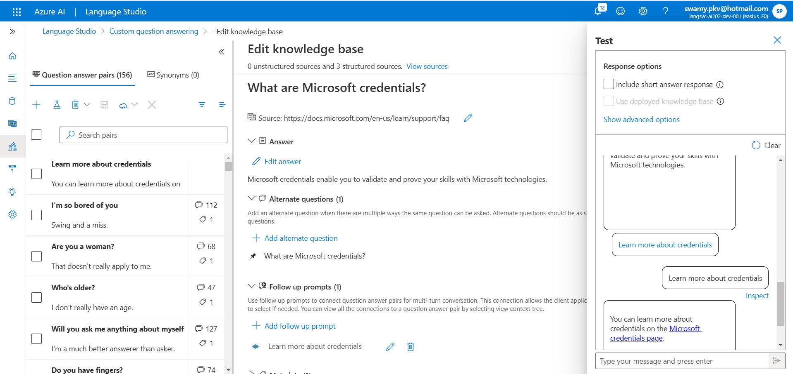
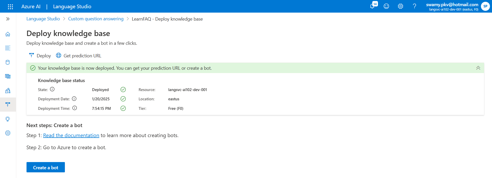
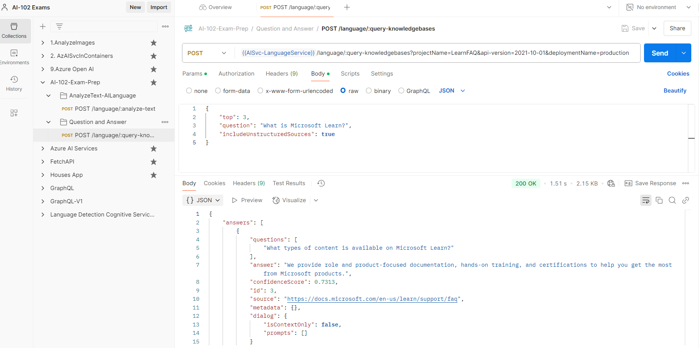
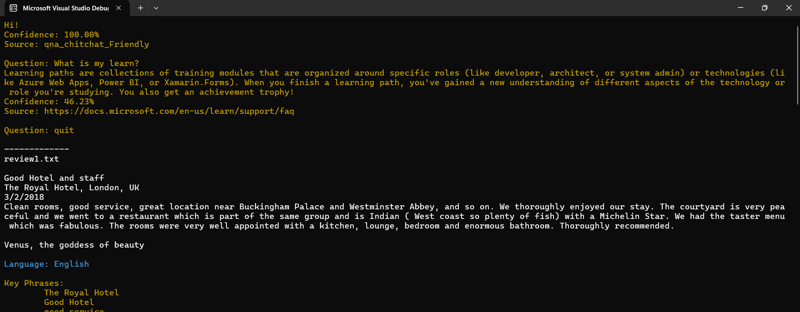

# AI-102 - Building Question Answering Solutions with Azure AI Language

## Date Time: 21-Jan-2025 at 03:30 PM IST

## Event URL: [https://www.meetup.com/microsoft-reactor-bengaluru/events/305161326](https://www.meetup.com/microsoft-reactor-bengaluru/events/305161326)

## YouTube URL: [https://www.youtube.com/watch?v=NYiRAMbK8Zw](https://www.youtube.com/watch?v=NYiRAMbK8Zw)

---

### Software/Tools

> 1. OS: Windows 10/11 x64
> 1. Python / .NET 8
> 1. Visual Studio 2022
> 1. Visual Studio Code

### Prior Knowledge

> 1. Programming knowledge in C# / Python

## Technology Stack

> 1. .NET 8, AI, Open AI

## Information

## What are we doing today?

> 1. The Big Picture
>    - Pre-requisites
>    - Previous Session(s)
>    - Microsoft Learn Module(s)
> 1. SUMMARY / RECAP / Q&A

### Please refer to the [**Source Code**](https://github.com/Swamy-s-Tech-Skills-Academy/learn-ai102-in-2025) of today's session for more details

---

---

## 1. The Big Picture

### 1.1. Pre-requisites

> 1. Azure Subscription
> 1. .NET 8 / Python

### 1.2. Previous Session(s)

> 1. <https://youtube.com/playlist?list=PLmsFUfdnGr3wmIh-glyiMkhHS6byEuI59&si=5vlmcUqOuWqFiCRR>

### 1.3. Microsoft Learn Module(s)

> 1. <https://aka.ms/OpenAI-RAG>

## 2. Understand question answering

> 1. Discussion and Demo

## 3. Compare question answering to Azure AI Language understanding

> 1. Discussion and Demo
> 1. <https://learn.microsoft.com/en-gb/training/modules/create-question-answer-solution-ai-language/3-compare-to-language-understanding>

## 4. Provision an Azure AI Language resource

> 1. Discussion and Demo
> 1. <https://language.cognitive.azure.com/home>

## 5. Create a question answering project

> 1. Discussion and Demo

## 6. Add sources to the knowledge base

> 1. Discussion and Demo

## 6. Edit the knowledge base

> 1. Discussion and Demo

## 7. Train and test the knowledge base

> 1. Discussion and Demo

## 8. Deploy the knowledge base

> 1. Discussion and Demo

## 9. Test the deploy API using Postman

> 1. Discussion and Demo
> 1. <https://langsvc-ai102-dev-001.cognitiveservices.azure.com/language/:query-knowledgebases?projectName=LearnFAQ&api-version=2021-10-01&deploymentName=production>

## 10. C# Code

> 1. Discussion and Demo

---

## SUMMARY / RECAP / Q&A

> 1. SUMMARY / RECAP / Q&A
> 2. Any open queries, I will get back through meetup chat/twitter.

---
