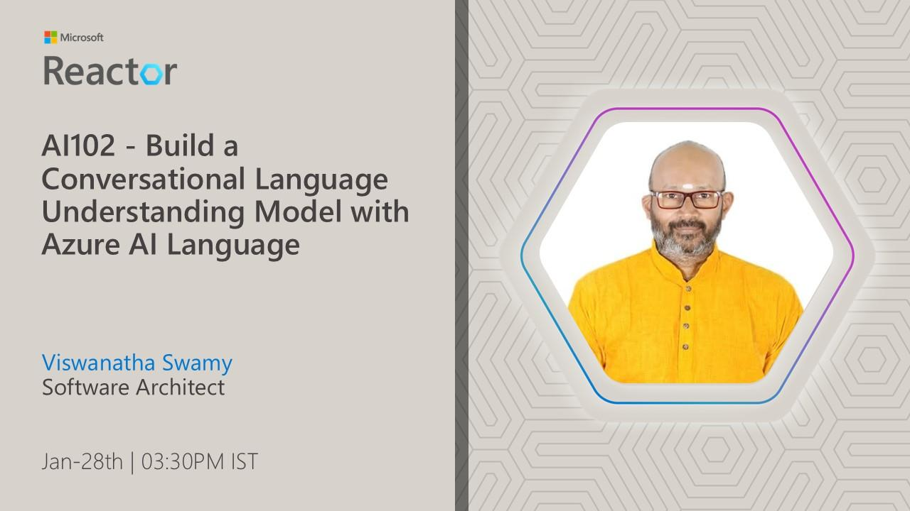

# AI-102 - Build a Conversational Language Understanding Model with Azure AI

## Date Time: 28-Jan-2025 at 03:30 PM IST

## Event URL: [https://www.meetup.com/microsoft-reactor-bengaluru/events/305178630](https://www.meetup.com/microsoft-reactor-bengaluru/events/305178630)

## YouTube URL: [https://www.youtube.com/watch?v=-52GQLl8p-4](https://www.youtube.com/watch?v=-52GQLl8p-4)

---

### Software/Tools

> 1. OS: Windows 10/11 x64
> 1. Python / .NET 8
> 1. Visual Studio 2022
> 1. Visual Studio Code

### Prior Knowledge

> 1. Programming knowledge in C# / Python

## Technology Stack

> 1. .NET 8, AI, Open AI

## Information

## What are we doing today?

> 1. The Big Picture
>    - Pre-requisites
>    - Previous Session(s)
>    - Microsoft Learn Module(s)
> 1. SUMMARY / RECAP / Q&A

### Please refer to the [**Source Code**](https://github.com/Swamy-s-Tech-Skills-Academy/learn-ai-102-code) of today's session for more details

---

---

## 1. The Big Picture

### 1.1. Pre-requisites

> 1. Azure Subscription
> 1. .NET 8 / Python

### 1.2. Previous Session(s)

> 1. <https://youtube.com/playlist?list=PLmsFUfdnGr3wmIh-glyiMkhHS6byEuI59&si=5vlmcUqOuWqFiCRR>

### 1.3. Microsoft Learn Module(s)

> 1. <https://aka.ms/AILanguage>

## 2. Introduction

This is the field of Natural Language Processing, or NLP. NLP encompasses a wide range of tasks, from simple text analysis to complex speech recognition. A key subset of NLP is Natural Language Understanding, or NLU. NLU is all about extracting the meaning from human language. It's not just about recognizing the words, but understanding what those words mean in context. Azure AI Language's Conversational Language Understanding, or CLU, is a specific NLU service on Azure. With CLU, you can train custom models to understand the intent behind user input and extract important details called entities. This allows your applications to have truly meaningful conversations with users.

---

## SUMMARY / RECAP / Q&A

> 1. SUMMARY / RECAP / Q&A
> 2. Any open queries, I will get back through meetup chat/twitter.

---
