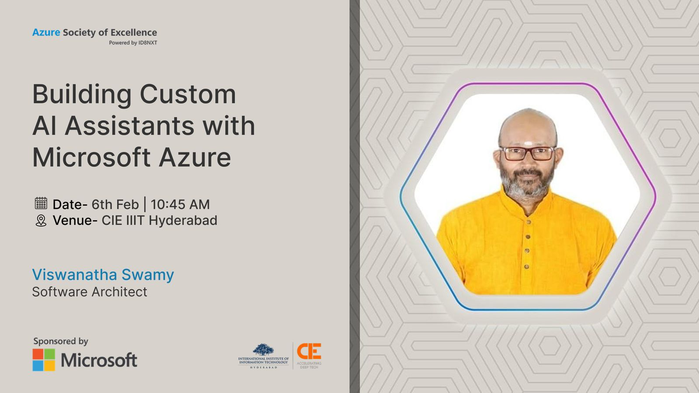

# Building Custom AI Assistants Azure Services

## Date Time: 06-Feb-2025 at 10:45 AM IST

## Event URL: [https://www.linkedin.com/feed/update/urn:li:activity:7290723380838735872](https://www.linkedin.com/feed/update/urn:li:activity:7290723380838735872)

<!-- ## YouTube URL: [https://www.youtube.com/watch?v=BtnhSKjRNWg](https://www.youtube.com/watch?v=BtnhSKjRNWg) -->

---

### Software/Tools

> 1. OS: Windows 10/11 x64
> 1. Python / .NET 8
> 1. Visual Studio 2022
> 1. Visual Studio Code

### Prior Knowledge

> 1. Programming knowledge in C# / Python

## Technology Stack

> 1. .NET 8, AI, Open AI

## Information

## What are we doing today?

> 1. The Big Picture
> 1. Introduction
> 1. SUMMARY / RECAP / Q&A

### Please refer to the [**Source Code**](https://github.com/Swamy-s-Tech-Skills-Academy/learn-ai-102-code) of today's session for more details

---

---

## 🚀 45-60 Minutes Demo Heavy Agenda

## 1. Quick Introduction (2 mins)

> 1. What’s an AI Assistant?
>    - Examples: Chatbots, Virtual Agents, Voice Assistants
>    - Real-world use cases: Customer support, automation, personal productivity
>    - **Example**: “Think about the last time you interacted with customer support online. Chances are, you spoke to an AI assistant without realizing it.

## 2. Azure Services Overview (2 mins)

> 1. Azure Cognitive Services: For vision, speech, and language APIs
> 1. Azure OpenAI Service: For powerful language models like GPT
> 1. Azure AI Studio: To build, fine-tune, and deploy custom models

## 3. ⚡Deep Dive into Azure AI Studio (5 mins)

> 1. Discussion and Demo
> 1. Grounding data, Testing interactions, Role Play (What is TV?)

## 4. ⚡Advanced Prompt Engineering (5 mins)

> 1. Discussion and Demo
> 1. Using Studio, Postman, C#

## 5. ⚡Implement (RAG) with Azure OpenAI (10 mins)

> 1. Discussion and Demo
> 1. Think of RAG as giving GPT access to a library of knowledge.

## 6. ⚡Building Question Answering Solutions (10 mins)

> 1. Discussion and Demo

## 7. ⚡Build a CLU Model with Azure AI Language (10 mins)

> 1. Discussion and Demo

## 8. ⚡Building Custom Text Classification Models with Azure AI Language (10 mins)

> 1. Discussion and Demo

## 9. ⚡eShopSupport (.NET Aspire App) Showcase (10 mins)

> 1. Discussion and Demo
> 1. <https://github.com/dotnet/eShopSupport>

---

## SUMMARY / RECAP / Q&A

> 1. SUMMARY / RECAP / Q&A
> 2. Any open queries, I will get back through meetup chat/twitter.

---
