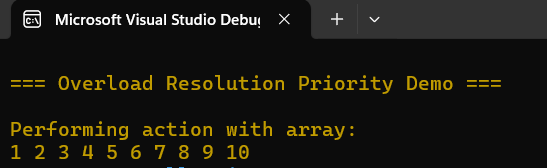
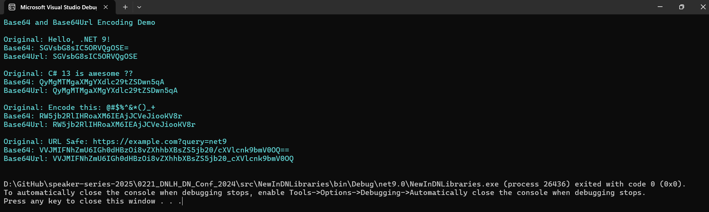
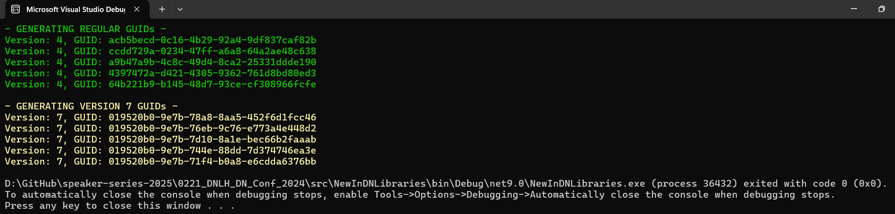
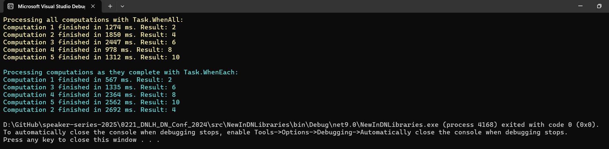
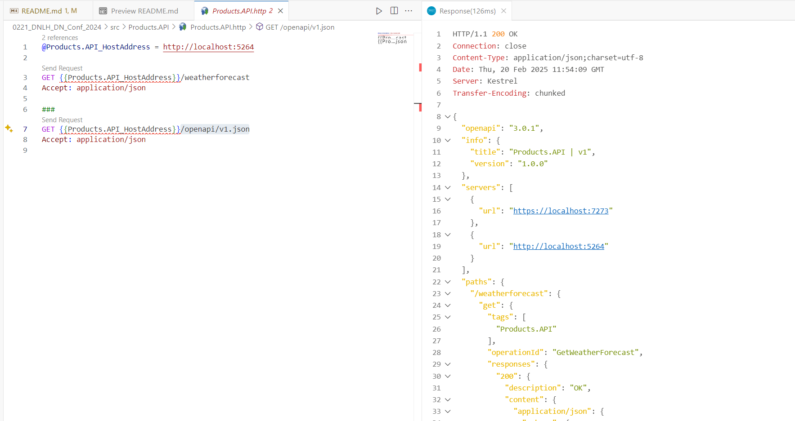
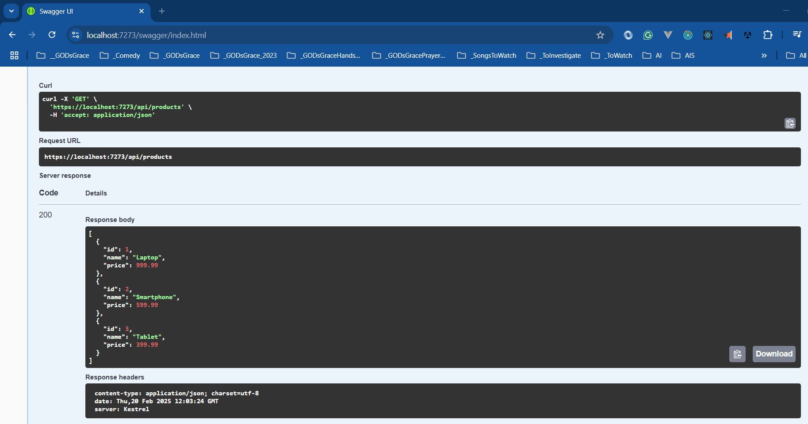
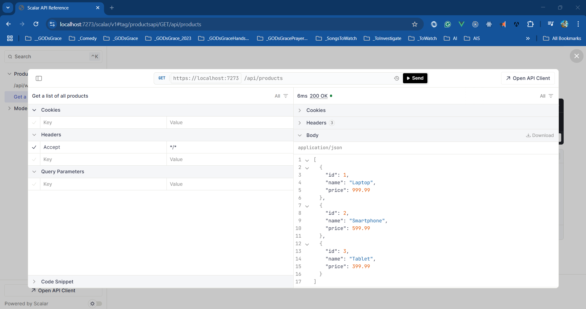

# .NET Conf 2024 - Dot Net Learners House Hyderabad

## Date Time: 21-Feb-2025 at 09:00 AM IST

## Event URL: [https://www.meetup.com/dot-net-learners-house-hyderabad/events/303337086](https://www.meetup.com/dot-net-learners-house-hyderabad/events/303337086)

## YouTube URL: [https://www.youtube.com/watch?v=IyE1-7cXano](https://www.youtube.com/watch?v=IyE1-7cXano)

---

### Software/Tools

> 1. OS: Windows 10/11 x64
> 1. .NET 8 / AZ CLI / AZD CLI
> 1. Visual Studio 2022
> 1. Visual Studio Code

### Prior Knowledge

> 1. Programming knowledge in C#

## Technology Stack

> 1. .NET 8/9, C#, Docker

## Information

## What are we doing today?

> 1. Introduction
> 1. What is new in C# 13 Features
>    - `params` collections
>    - New `Escape` Sequence
>    - `field` Keyword
>    - Overload Resolution Priority
> 1. What is new in .NET libraries
> 1. OpenAPI support in ASP.NET Core API
> 1. SUMMARY / RECAP / Q&A

### Please refer to the [**Source Code**](https://github.com/vishipayyallore/speaker-series-2025/tree/main/0221_DNLH_DN_Conf_2024/src) of today's session for more details

---

---

## 1. Introduction to .NET Conf 2024 / .NET 9

> 1. Discussion and Demo
> 1. <https://learn.microsoft.com/en-gb/dotnet/core/whats-new/dotnet-9/overview>

## 2. What is new in C# 13 Features

> 1. Discussion and Demo
> 1. <https://learn.microsoft.com/en-us/dotnet/csharp/whats-new/csharp-13>

### 2.1. `params` collections

> 1. Discussion and Demo

### 2.2. New `Escape` Sequence

> 1. Discussion and Demo
> 1. <https://learn.microsoft.com/en-us/dotnet/csharp/whats-new/csharp-13#new-escape-sequence>

### 2.3. `field` Keyword

> 1. Discussion and Demo
> 1. <https://learn.microsoft.com/en-us/dotnet/csharp/whats-new/csharp-13#the-field-keyword>

### 2.4. Overload Resolution Priority

> 1. Discussion and Demo
> 1. <https://learn.microsoft.com/en-us/dotnet/csharp/whats-new/csharp-13#the-field-keyword>

## 3. What is new in .NET libraries

> 1. Discussion and Demo
> 1. <https://learn.microsoft.com/en-gb/dotnet/core/whats-new/dotnet-9/libraries>

### 3.1. `Base64Url`

> 1. Discussion and Demo
> 1. <https://learn.microsoft.com/en-gb/dotnet/core/whats-new/dotnet-9/libraries#base64url>

### 3.2. `GuidVersion7`

> 1. Discussion and Demo
> 1. <https://learn.microsoft.com/en-gb/dotnet/core/whats-new/dotnet-9/libraries#systemguid>

### 3.3. `TaskWhenEach`

> 1. Discussion and Demo
> 1. <https://learn.microsoft.com/en-gb/dotnet/core/whats-new/dotnet-9/libraries#threading>

## 4. OpenAPI support in ASP.NET Core API

> 1. Discussion and Demo
> 1. <https://learn.microsoft.com/en-us/aspnet/core/release-notes/aspnetcore-9.0?view=aspnetcore-9.0#openapi>

### 4.1. Open API Specification

> 1. <https://localhost:7273/openapi/v1.json>

### 4.2. Open API and Swagger

> 1. <https://localhost:7273/swagger/index.html>

### 4.2. Open API and Scalar

## SUMMARY / RECAP / Q&A

> 1. SUMMARY / RECAP / Q&A

---
