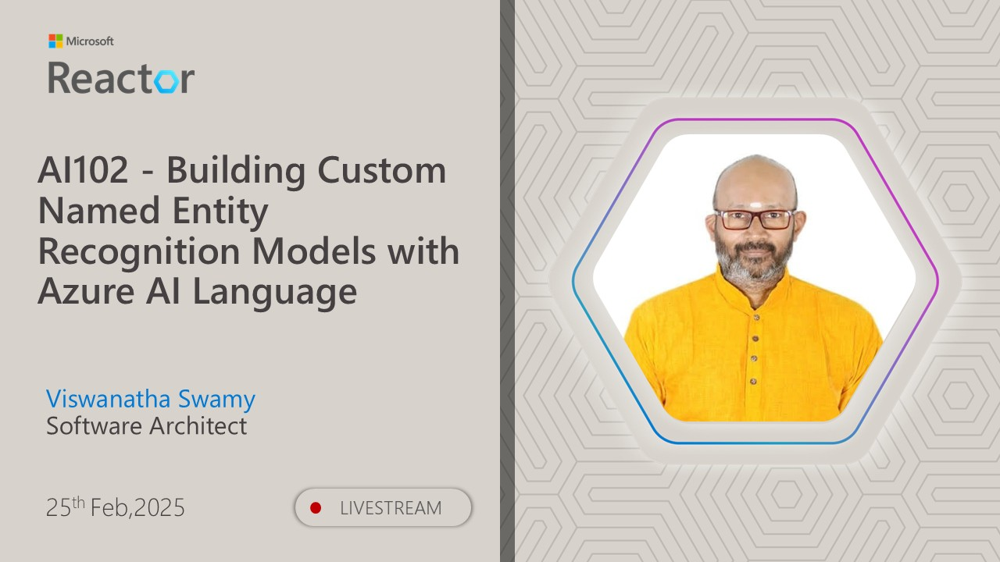
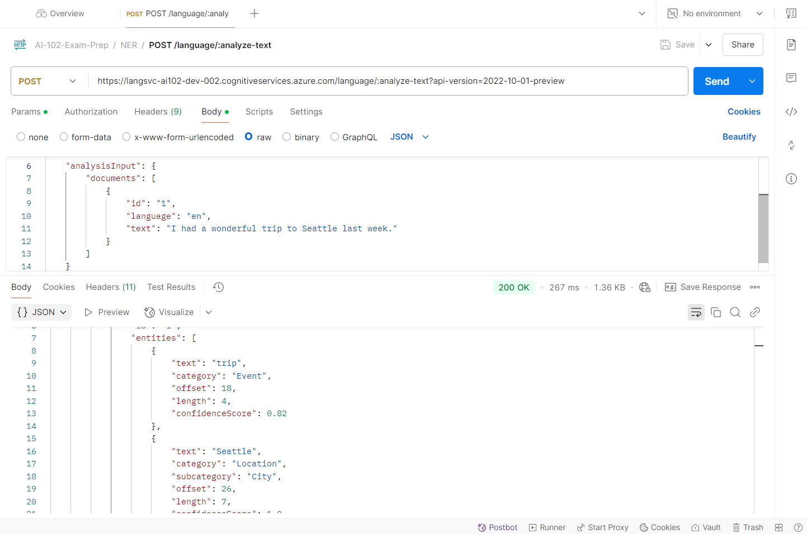

# AI-102 - Building Custom Named Entity Recognition Models with Azure AI Language

## Date Time: 25-Feb-2025 at 03:30 PM IST

## Event URL: [https://www.meetup.com/microsoft-reactor-bengaluru/events/305788277](https://www.meetup.com/microsoft-reactor-bengaluru/events/305788277)

## YouTube URL: [https://www.youtube.com/watch?v=X0GDn-F1zGo](https://www.youtube.com/watch?v=X0GDn-F1zGo)

---

### Software/Tools

> 1. OS: Windows 10/11 x64
> 1. Python / .NET 8
> 1. Visual Studio 2022
> 1. Visual Studio Code

### Prior Knowledge

> 1. Programming knowledge in C# / Python

## Technology Stack

> 1. .NET 8, AI, Open AI

## Information

## What are we doing today?

> 1. The Big Picture
>    - Pre-requisites
>    - Previous Session(s)
>    - Microsoft Learn Module(s)
> 1. Introduction
> 1. SUMMARY / RECAP / Q&A

### Please refer to the [**Source Code**](https://github.com/Swamy-s-Tech-Skills-Academy/learn-ai-102-code) of today's session for more details

---

---

## 1. The Big Picture

### 1.1. Pre-requisites

> 1. Azure Subscription
> 1. .NET 8 / Python

### 1.2. Previous Session(s)

> 1. <https://youtube.com/playlist?list=PLmsFUfdnGr3wmIh-glyiMkhHS6byEuI59&si=5vlmcUqOuWqFiCRR>

### 1.3. Microsoft Learn Module(s)

> 1. <https://aka.ms/Entity-Recognition>

## 2. Introduction

> 1. Discussion and Demo
> 1. <https://learn.microsoft.com/en-gb/training/modules/custom-name-entity-recognition/1-introduction>

## 3. Built-in named entity recognition

> 1. Discussion and Demo
> 1. <https://learn.microsoft.com/en-us/azure/ai-services/language-service/named-entity-recognition/quickstart?tabs=windows%2Cga-api&pivots=rest-api>
> 1. Verifying it in Postman

## 3. Understand custom named entity recognition

> 1. Discussion and Demo
> 1. <https://learn.microsoft.com/en-gb/training/modules/custom-name-entity-recognition/2-understand-custom-named>

---

## SUMMARY / RECAP / Q&A

> 1. SUMMARY / RECAP / Q&A
> 2. Any open queries, I will get back through meetup chat/twitter.

---
