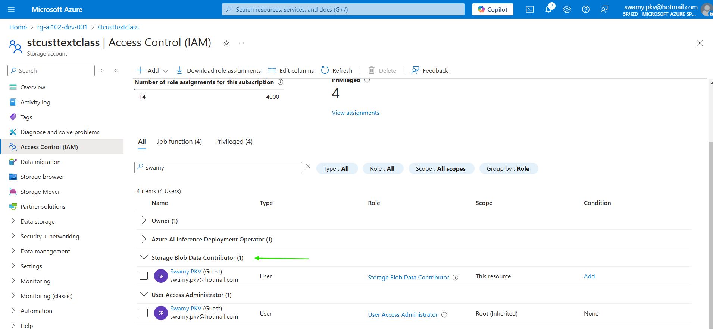
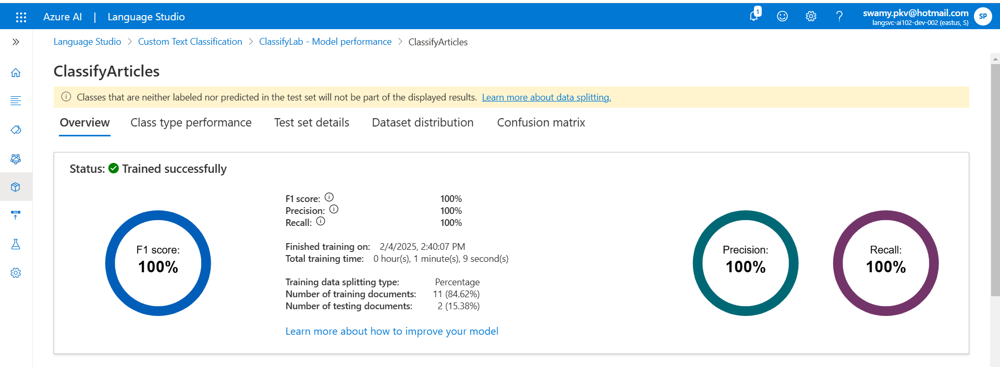

# AI-102 - Building Custom Text Classification Models with Azure AI Language

## Date Time: 04-Feb-2025 at 03:30 PM IST

## Event URL: [https://www.meetup.com/microsoft-reactor-bengaluru/events/305749942](https://www.meetup.com/microsoft-reactor-bengaluru/events/305749942)

## YouTube URL: [https://www.youtube.com/watch?v=BtnhSKjRNWg](https://www.youtube.com/watch?v=BtnhSKjRNWg)

---

### Software/Tools

> 1. OS: Windows 10/11 x64
> 1. Python / .NET 8
> 1. Visual Studio 2022
> 1. Visual Studio Code

### Prior Knowledge

> 1. Programming knowledge in C# / Python

## Technology Stack

> 1. .NET 8, AI, Open AI

## Information

## What are we doing today?

> 1. The Big Picture
>    - Pre-requisites
>    - Previous Session(s)
>    - Microsoft Learn Module(s)
> 1. Introduction
> 1. SUMMARY / RECAP / Q&A

### Please refer to the [**Source Code**](https://github.com/Swamy-s-Tech-Skills-Academy/learn-ai-102-code) of today's session for more details

---

---

## 1. The Big Picture

### 1.1. Pre-requisites

> 1. Azure Subscription
> 1. .NET 8 / Python

### 1.2. Previous Session(s)

> 1. <https://youtube.com/playlist?list=PLmsFUfdnGr3wmIh-glyiMkhHS6byEuI59&si=5vlmcUqOuWqFiCRR>

### 1.3. Microsoft Learn Module(s)

> 1. <https://aka.ms/AILanguage>

## 2. Introduction

To be done

こんにちは
你好
नमस्ते
Bonjour
नमस्कार

## 3. Provision an Azure AI Language resource

> 1. Discussion and Demo

## 4. Roles for your user

> 1. Discussion and Demo

## 5. Upload sample articles

> 1. Discussion and Demo

### 5.1. Stroage Account Configuration

### 5.2. Articles Uploaded

## 6. Create a custom text classification project

> 1. Discussion and Demo

## 7. Label your data

> 1. Discussion and Demo

## 8. Train your model

> 1. Discussion and Demo

## 9. Evaluate your model

> 1. Discussion and Demo

## 10. Deploy your model

> 1. Discussion and Demo

## 11. Test in Postman

> 1. Discussion and Demo

## 12. App in VS Code / VS 2022

> 1. Discussion and Demo

---

## SUMMARY / RECAP / Q&A

> 1. SUMMARY / RECAP / Q&A
> 2. Any open queries, I will get back through meetup chat/twitter.

---
