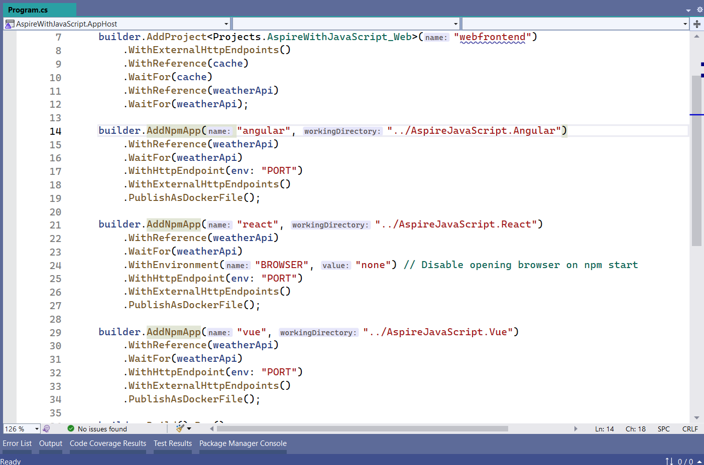
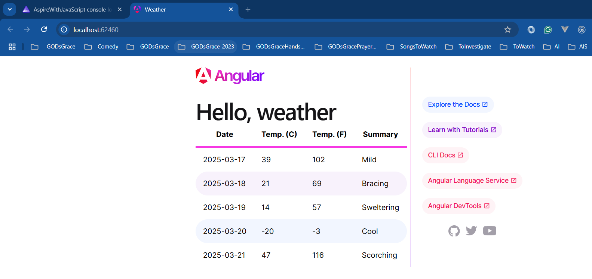
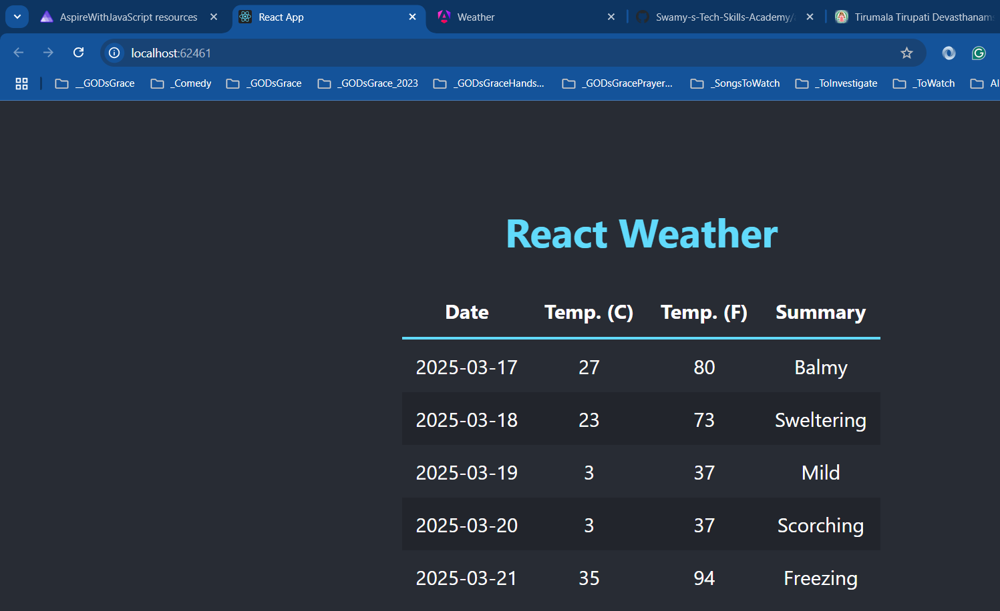
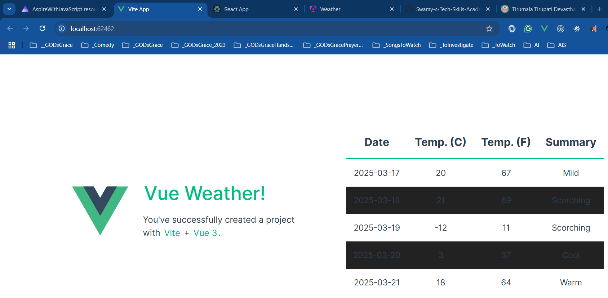

# 📢 Dot Net Learners House Meetup – Monthly Event - Mar 2025

## Date Time: 16-Mar-2025 at 09:00 AM IST

## Event URL: [https://www.meetup.com/dot-net-learners-house-hyderabad/events/304750920](https://www.meetup.com/dot-net-learners-house-hyderabad/events/304750920)

## YouTube URL: [https://www.youtube.com/watch?v=rrZqYt2YDFM](https://www.youtube.com/watch?v=rrZqYt2YDFM)

---

### Software/Tools

> 1. OS: Windows 10/11 x64
> 1. .NET 8 / AZ CLI / AZD CLI
> 1. Visual Studio 2022
> 1. Visual Studio Code

### Prior Knowledge

> 1. Programming knowledge in C#

## Technology Stack

> 1. .NET 8/9, C#, Docker

## Information

## What are we doing today?

> 1. Introduction to `JavaScript` applications inside .NET 9 Aspire
> 1. `Angular` application inside .NET 9 Aspire
> 1. `React.js` application inside .NET 9 Aspire
> 1. `Vue` application inside .NET 9 Aspire
> 1. SUMMARY / RECAP / Q&A

### Please refer to the [**Source Code**](https://github.com/Swamy-s-Tech-Skills-Academy/aspire-2025) of today's session for more details

---

---

## 1. Introduction to `JavaScript` applications inside .NET 9 Aspire

> 1. Discussion and Demo

## 2. `Angular` application inside .NET 9 Aspire

> 1. Discussion and Demo

## 3. `React.js` application inside .NET 9 Aspire

> 1. Discussion and Demo

## 4. `Vue` application inside .NET 9 Aspire

> 1. Discussion and Demo

## SUMMARY / RECAP / Q&A

> 1. SUMMARY / RECAP / Q&A

---
