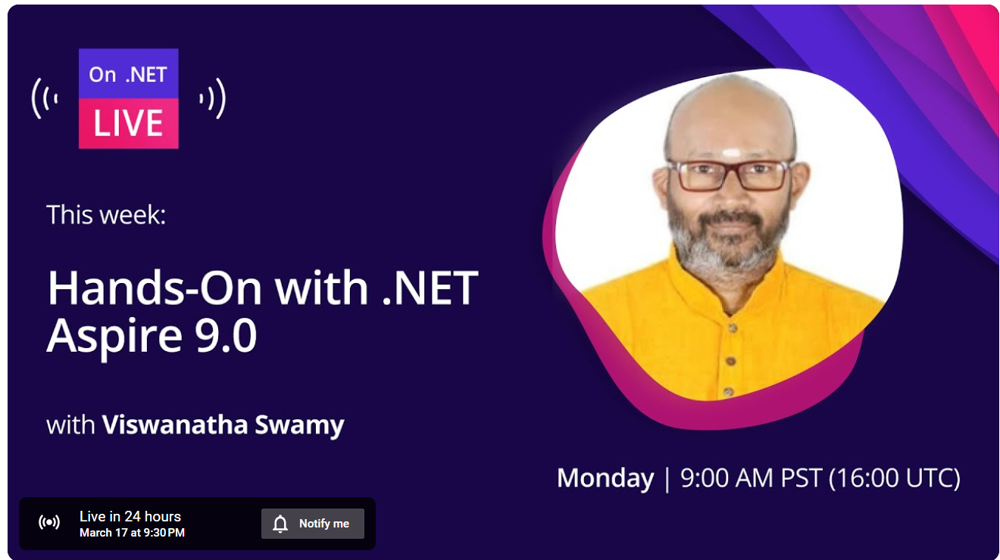
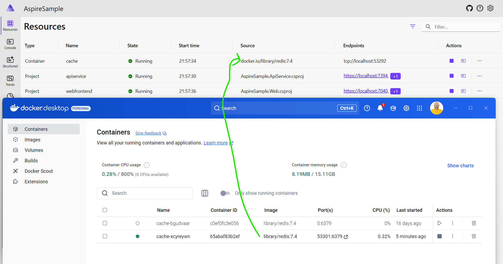
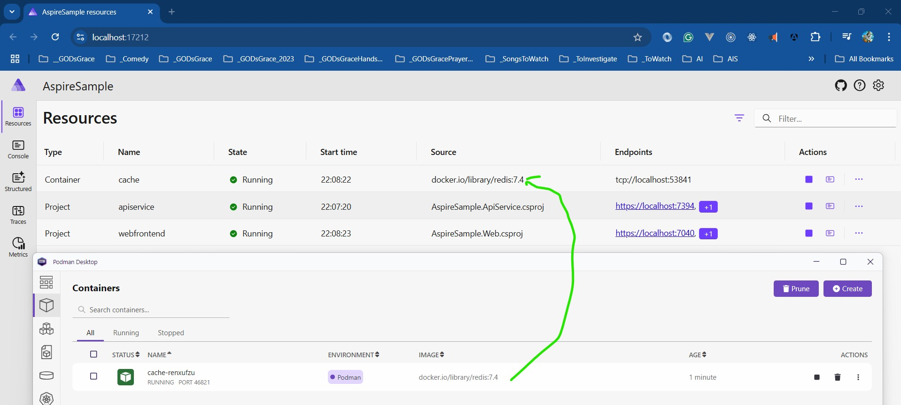
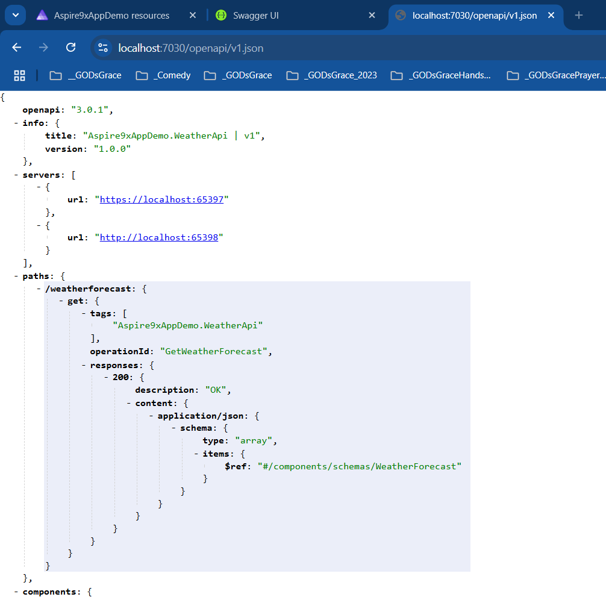
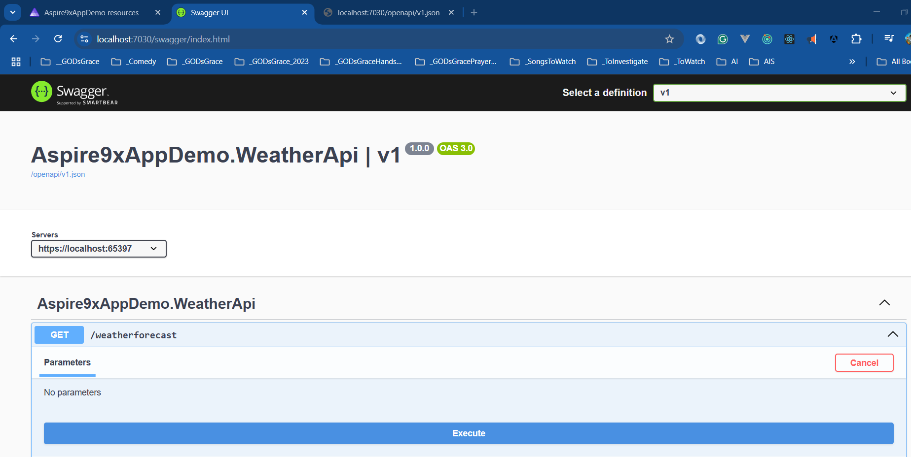

# Hands-On with .NET 9 Aspire 9

## Date Time: 17-Mar-2025 at 09:30 PM IST

## Event URL: [https://dotnet.microsoft.com/en-us/live/on-dotnet-live](https://dotnet.microsoft.com/en-us/live/on-dotnet-live)

## YouTube URL: [https://www.youtube.com/watch?v=OXEAyLPty1g&list=PLdo4fOcmZ0oV2fcY7wsQHx4RNWXEDKgm4&index=1](https://www.youtube.com/watch?v=OXEAyLPty1g&list=PLdo4fOcmZ0oV2fcY7wsQHx4RNWXEDKgm4&index=1)

---

### Software/Tools

> 1. OS: Windows 10/11 x64
> 1. .NET 8/9 / AZ CLI / AZD CLI
> 1. Visual Studio 2022
> 1. Visual Studio Code

### Prior Knowledge

> 1. Programming knowledge in C#
> 1. Microservices / Distributed applications

## Technology Stack

> 1. .NET 8/9, C#, Docker

## Information

## What are we doing today?

> 1. The Big Picture
> 1. SUMMARY / RECAP / Q&A

### Please refer to the [**Source Code**](https://github.com/vishipayyallore/learn-aspire-2025) of today's session for more details

---

---

## ⏳ Introduction - What's New in .NET Aspire 9.0 / 9.1

> 1. 🔹 Overview of .NET Aspire 9.0 / 9.1
> 1. 🔹 Key improvements in tooling, dashboard, and telemetry
> 1. 🔹 <https://learn.microsoft.com/en-us/dotnet/aspire/whats-new/>
> 1. 🔹 <https://learn.microsoft.com/en-us/dotnet/aspire/whats-new/dotnet-aspire-9?tabs=windows>
> 1. 🔹 <https://learn.microsoft.com/en-us/dotnet/aspire/whats-new/dotnet-aspire-9.1>

## ⚡ Hands-On: Exploring .NET Aspire 9.0/9.1 Apps in `VS Code`

> 1. Discussion and Demo
> 1. Creation, Adding to existing Project, and Executing

## Containers with Docker and Podman

### Container in Docker

### Container in Podman

## Open API Support

> 1. Discussion and Demo
> 1. <https://localhost:7030/openapi/v1.json>
> 1. <https://localhost:7030/swagger>

### **⚡ Hands-On: Exploring .NET Aspire 9.1 (10 mins)**

🔹 New .NET Aspire SDK & improved developer experience  
🔹 Updated Aspire templates & streamlined setup process

### **🎨 Enhancements in .NET Aspire Dashboard (10 mins)**

🔹 Managing resource lifecycles (Start/Stop/Restart)  
🔹 Console log improvements (color-coded logs)  
🔹 Improved mobile-friendly & responsive UI

### **🛠️ Hands-On: App Host & Resource Management (10 mins)**

🔹 Waiting for dependencies before startup  
🔹 Implementing resource health checks with HTTP endpoints  
🔹 Persistent containers & custom resource commands

### **🛠️ Hands-On: Working with MS SQL Server & Redis Locally (10 mins)**

🔹 Running MS SQL Server in a container  
🔹 Running Redis in a container  
🔹 _(Stretch Goal)_: Integrating Azure OpenAI

### **📊 Hands-On: Advanced Telemetry & Observability (10 mins)**

🔹 Configuring telemetry filtering  
🔹 Enabling browser telemetry  
🔹 Combining telemetry from multiple resources

### **❓ Q&A & Closing Remarks (5 mins)**

🔹 Summary of key takeaways  
🔹 Resources for further learning

## SUMMARY / RECAP / Q&A

> 1. SUMMARY / RECAP / Q&A

---
