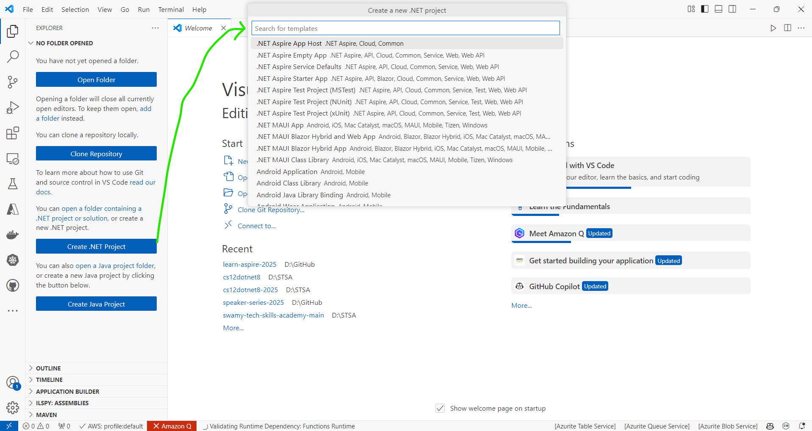

# Hands-On with .NET 9 Aspire 9

## Date Time: 17-Mar-2025 at 09:30 PM IST

## Event URL: [https://dotnet.microsoft.com/en-us/live/on-dotnet-live](https://dotnet.microsoft.com/en-us/live/on-dotnet-live)

## YouTube URL: [https://www.youtube.com/watch?v=OXEAyLPty1g&list=PLdo4fOcmZ0oV2fcY7wsQHx4RNWXEDKgm4&index=1](https://www.youtube.com/watch?v=OXEAyLPty1g&list=PLdo4fOcmZ0oV2fcY7wsQHx4RNWXEDKgm4&index=1)

---

### Software/Tools

> 1. OS: Windows 10/11 x64
> 1. .NET 8/9 / AZ CLI / AZD CLI
> 1. Visual Studio 2022
> 1. Visual Studio Code

### Prior Knowledge

> 1. Programming knowledge in C#
> 1. Microservices / Distributed applications

## Technology Stack

> 1. .NET 8/9, C#, Docker

## Information

## What are we doing today?

> 1. Introduction - What's New in .NET Aspire 9.0 / 9.1
> 1. Upgrade to .NET Aspire 9.0/9.1
> 1. Tooling improvements
>    - Containers with Docker and Podman
>    - Hands-On: Exploring .NET Aspire 9.0/9.1 Apps in `VS Code`
> 1. Improved onboarding experience
> 1. Dashboard UX enhancements
>    - Manage resource lifecycle
>    - Sensitive properties, volumes, and health checks in resource details
>    - Resource relationships
>    - Localization overrides
>    - Resource Management
> 1. Hands-On: Working with MS SQL Server & Redis Locally
> 1. JavaScript (Angular, React.js, and Vue.js) Applications inside .NET Aspire 9.0/9.1
> 1. Hands-On: Advanced Telemetry & Observability
> 1. SUMMARY / RECAP / Q&A

### Please refer to the [**Source Code**](https://github.com/vishipayyallore/learn-aspire-2025) of today's session for more details

---

---

## 1. ⏳ Introduction - What's New in .NET Aspire 9.0 / 9.1

> 1. 🔹 Overview of .NET Aspire 9.0 / 9.1
> 1. 🔹 Key improvements in tooling, dashboard, and telemetry
> 1. 🔹 <https://learn.microsoft.com/en-us/dotnet/aspire/whats-new/>
> 1. 🔹 <https://learn.microsoft.com/en-us/dotnet/aspire/whats-new/dotnet-aspire-9?tabs=windows>
> 1. 🔹 <https://learn.microsoft.com/en-us/dotnet/aspire/whats-new/dotnet-aspire-9.1>

## 2. ⚡ Upgrade to .NET Aspire 9.0/9.1

> 1. Discussion and Demo
> 1. <https://learn.microsoft.com/en-us/dotnet/aspire/whats-new/dotnet-aspire-9?tabs=windows#upgrade-to-net-aspire-9>
> 1. <https://learn.microsoft.com/en-us/dotnet/aspire/whats-new/dotnet-aspire-9.1#-upgrade-to-net-aspire-91>

## 3. ⚡ Tooling improvements

> 1. Discussion and Demo

### ⚡ 3.1. Containers with Docker and Podman

#### Container in Docker

#### Container in Podman

### 3.2.⚡ Hands-On: Exploring .NET Aspire 9.0/9.1 Apps in `VS Code`

> 1. Discussion and Demo
> 1. Creation, Adding to existing Project, and Executing
> 1. <https://learn.microsoft.com/en-us/dotnet/aspire/fundamentals/setup-tooling?tabs=windows&pivots=visual-studio>

## 4. ⚡ Improved onboarding experience

> 1. Discussion and Demo

## 5. 🎨 Dashboard UX enhancements

> 1. Discussion and Demo

### 5.1. Manage resource lifecycle

> 1. Discussion and Demo - Live
> 1. <https://learn.microsoft.com/en-us/dotnet/aspire/fundamentals/dashboard/explore#stop-or-start-a-resource>

### 5.2. Sensitive properties, volumes, and health checks in resource details

> 1. Discussion and Demo
> 1. <https://learn.microsoft.com/en-us/dotnet/aspire/whats-new/dotnet-aspire-9?tabs=windows#resource-health-checks>

### 5.3. Resource relationships

> 1. Discussion and Demo

### 5.4. Localization overrides

> 1. Discussion and Demo

### 5.5. 🛠️ Resource Management

> 🔹 Waiting for dependencies before startup  
> 🔹 Implementing resource health checks with HTTP endpoints  
> 🔹 Persistent containers & custom resource commands

## 6. 🛠️ Hands-On: Working with MS SQL Server & Redis Locally

🔹 Running MS SQL Server in a container  
🔹 Running Redis in a container

## 7. 📊 JavaScript (Angular, React.js, and Vue.js) Applications inside .NET Aspire 9.0/9.1

> 🔹 Discussion and Demo

## 8. 📊 Hands-On: Advanced Telemetry & Observability

> 🔹 Configuring telemetry filtering

## 9. Open API Support

> 1. Discussion and Demo
> 1. <https://localhost:7030/openapi/v1.json>
> 1. <https://localhost:7030/swagger>

### 10.❓ Q&A & Closing Remarks (5 mins)\*\*

🔹 Summary of key takeaways  
🔹 Resources for further learning

---
