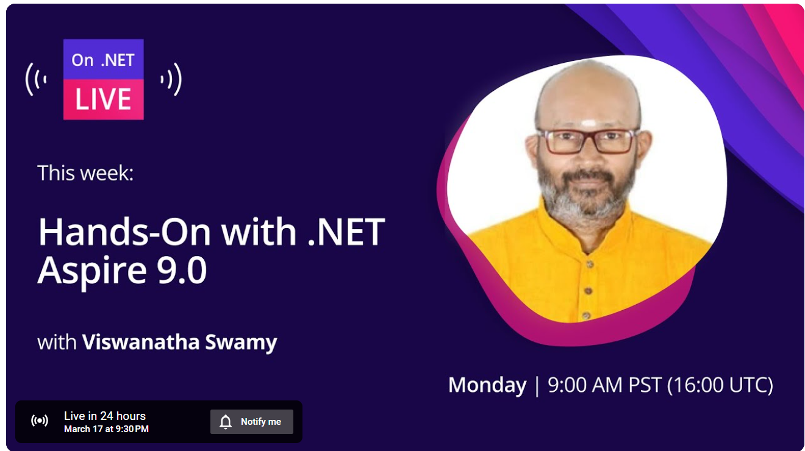

# .NET 9 Aspire - Local development with Docker, and Podman

## Date Time: 05-Jan-2025 at 09:00 AM IST

## Event URL: [https://www.meetup.com/dot-net-learners-house-hyderabad/events/302915015](https://www.meetup.com/dot-net-learners-house-hyderabad/events/302915015)

## YouTube URL: [https://www.youtube.com/watch?v=aV-e4CFMT_w](https://www.youtube.com/watch?v=aV-e4CFMT_w)

---

### Software/Tools

> 1. OS: Windows 10/11 x64
> 1. .NET 8 / AZ CLI / AZD CLI
> 1. Visual Studio 2022
> 1. Visual Studio Code

### Prior Knowledge

> 1. Programming knowledge in C#
> 1. Microservices / Distributed applications

## Technology Stack

> 1. .NET 8, C#, Docker

## Information

## What are we doing today?

> 1. The Big Picture
> 1. SUMMARY / RECAP / Q&A

### Please refer to the [**Source Code**](https://github.com/vishipayyallore/learn-aspire-2025) of today's session for more details

---

---

## 🚀 **What's New in .NET Aspire 9.1: Hands-On Demos & Key Enhancements**

### **⏳ Introduction (5 mins)**

🔹 Overview of .NET Aspire 9.1  
🔹 Key improvements in tooling, dashboard, and telemetry

### **⚡ Hands-On: Exploring .NET Aspire 9.1 (10 mins)**

🔹 New .NET Aspire SDK & improved developer experience  
🔹 Updated Aspire templates & streamlined setup process

### **🎨 Enhancements in .NET Aspire Dashboard (10 mins)**

🔹 Managing resource lifecycles (Start/Stop/Restart)  
🔹 Console log improvements (color-coded logs)  
🔹 Improved mobile-friendly & responsive UI

### **🛠️ Hands-On: App Host & Resource Management (10 mins)**

🔹 Waiting for dependencies before startup  
🔹 Implementing resource health checks with HTTP endpoints  
🔹 Persistent containers & custom resource commands

### **🛠️ Hands-On: Working with MS SQL Server & Redis Locally (10 mins)**

🔹 Running MS SQL Server in a container  
🔹 Running Redis in a container  
🔹 _(Stretch Goal)_: Integrating Azure OpenAI

### **📊 Hands-On: Advanced Telemetry & Observability (10 mins)**

🔹 Configuring telemetry filtering  
🔹 Enabling browser telemetry  
🔹 Combining telemetry from multiple resources

### **❓ Q&A & Closing Remarks (5 mins)**

🔹 Summary of key takeaways  
🔹 Resources for further learning

## SUMMARY / RECAP / Q&A

> 1. SUMMARY / RECAP / Q&A

---
