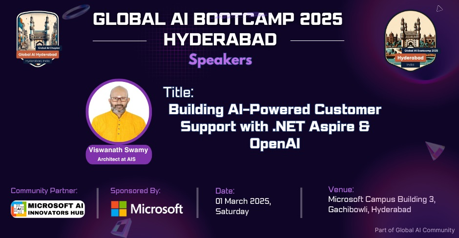

# Global AI Hyderabad - Monthly Online Event - Mar 2025

## Date Time: 23-Mar-2025 at 09:00 AM IST

## Event URL: [https://www.meetup.com/global-ai-hyderabad/events/306606120](https://www.meetup.com/global-ai-hyderabad/events/306606120)

## YouTube: [https://www.youtube.com/watch?v=RUeaM9Rix60](https://www.youtube.com/watch?v=RUeaM9Rix60)

<!--  -->

---

### Software/Tools

> 1. OS: Windows 10/11 x64
> 1. Python / .NET 8
> 1. Visual Studio 2022
> 1. Visual Studio Code

### Prior Knowledge

> 1. Programming knowledge in C# / Python

## Technology Stack

> 1. .NET 8, AI, Open AI

## Information


## What are we doing today?

> 1. The Big Picture
> 1. SUMMARY / RECAP / Q&A

### Please refer to the [**Source Code**](https://github.com/Swamy-s-Tech-Skills-Academy/learn-ai-102-code) of today's session for more details

---


---

## 🚀 1. Introduction

> 1. Discussion and Demo


## 🛠 2. Project Setup

> 1. Discussion and Demo
> 1. Create a virtual environment and install dependencies.

```text
python -m venv .venv
.\.venv\Scripts\activate  # (Windows)
source .venv/bin/activate  # (Mac/Linux)
pip install flask flask-sqlalchemy python-dotenv openai
```

## 📂 3. Folder Structure

> 1. Explain the folder structure (briefly, using a simplified diagram).

```text
openai-chat-flask/
├── app.py                  # Application entry point
├── requirements.txt        # Dependencies
├── .env                    # Environment variables
├── README.md               # Documentation
└── website/                # Main Flask package
    ├── __init__.py         # App factory (configures app, database, registers blueprints)
    ├── data/               # Database-related code
    │   ├── __init__.py     # (Optional) Exposes models
    │   └── models.py       # SQLAlchemy models (e.g., ChatHistory)
    ├── api/                # API endpoints
    │   ├── __init__.py     # Imports blueprint from chat.py
    │   └── chat.py         # Chat API route that interacts with OpenAI
    ├── views/              # View (template) routes
    │   ├── __init__.py     # Imports blueprint from home.py
    │   └── home.py         # Routes for Home, ST Chat Bot, and History pages
    ├── static/             # Static assets (CSS, images)
    │   ├── favicon.ico
    │   └── globalstyles.css
    └── templates/          # Jinja2 templates
        ├── base.html       # Base layout (includes navbar and footer)
        ├── navbar.html     # Navbar (included in base.html)
        ├── Footer.html     # Footer (included in base.html)
        ├── home.html       # Home page overview
        ├── stchatbot.html  # Single Turn Chat Bot page (chat interface)
        └── history.html    # Search History page (placeholder or history display)
```

## 🔗 4. Modular Design

> 1. Discussion and Demo

### 4.1. Benefits of Modular Design

#### Separation of Concerns

> 1. Views (views/home.py) handle rendering HTML pages.
> 1. APIs (api/chat.py) handle JSON-based requests.
> 1. Database (data/models.py) stores chat history.

#### Easier Debugging & Maintenance

> 1. The app is structured into clear, self-contained components.
> 1. A bug in one module doesn’t affect the others.

#### Scalability

> 1. We can easily add new blueprints (e.g., Authentication, Admin Panel).
> 1. Supports microservices or external APIs without modifying the entire application.

#### Reusability

> 1. Components like views, API routes, and database models can be reused in different projects.

## 📌 5. App Initialization

### 5.1. What Is an App Factory?

> An app factory is a function (commonly named create_app()) that sets up and returns a fully configured Flask application instance. This pattern allows you to configure your application dynamically, register blueprints (which help separate different parts of your app), and initialize extensions (like SQLAlchemy) all in one place.

### 5.2. Role of app.py

> app.py serves as the entry point of your application. Its main job is to call the app factory and start the server. This keeps the configuration logic (like registering blueprints, setting up the database, and loading environment variables) separate from the code that actually runs the server.

📝 `app.py`

```python
from website import create_app

app = create_app()

if __name__ == '__main__':
    app.run(debug=True)
```

## 📌 6. Blueprint Structure

> 1. Discussion and Demo

### 6.1. Main App Initialization (website/`init.py`)

This file is the central place where the Flask application is created. It configures the app, initializes extensions (like SQLAlchemy), and registers the blueprints from both the views and API modules.

📝 `website/__init__.py`

```python
def create_app():
    app = Flask(__name__)
    app.config['SQLALCHEMY_DATABASE_URI'] = "sqlite:///database.db"

    from .views import views
    from .api import api
    app.register_blueprint(views, url_prefix="/")
    app.register_blueprint(api, url_prefix="/api")

    return app
```

#### 6.1.1. Key Points

> 1. Loads environment variables.
> 1. Configures app settings (secret key, database URI, etc.).
> 1. Initializes the database.
> 1. Registers two major blueprints
>    - Views Blueprint: For routes that render HTML templates.
>    - API Blueprint: For endpoints that return JSON responses.

### 6.2. View Routes (website/views/home.py)

This module contains routes responsible for rendering HTML templates. They handle user navigation and display pages such as Home, Single Turn Chat Bot, and Search History.

📂 website/views/home.py

```python
from flask import Blueprint, render_template

views = Blueprint("views", __name__)

@views.route("/")
def home():
    return render_template("home.html")
```

#### 6.2.1. Key Points

> 1. Defines a blueprint named views.
> 1. Contains routes like `/`, `/stchatbot`, and `/history`.
> 1. Each route calls render_template() to display the appropriate page.

### 6.3. API Endpoints (website/api/chat.py)

This module contains endpoints that interact with external services (like OpenAI) and return JSON responses. In this case, the /api/chat endpoint receives a user message, sends it to the OpenAI API, and returns the bot's response.

📂 website/api/chat.py

```python
from flask import Blueprint, request, jsonify
import openai

api = Blueprint("api", __name__)

@api.route("/chat", methods=["POST"])
def chat():
    data = request.get_json()
    response = openai.ChatCompletion.create(
        model="gpt-3.5-turbo",
        messages=[{"role": "user", "content": data["message"]}],
    )
    return jsonify({"response": response["choices"][0]["message"]["content"]})
```

#### 6.3.1. Key Points

> 1. Defines a blueprint named api.
> 1. Contains the /chat route for handling POST requests.
> 1. Processes JSON data, validates input, calls the OpenAI API, and returns a JSON response.

## ▶️ 7. Running the App and show Navigation

> 1. Navigating between routes (Home, ST Chat Bot, History).

## 💬 8. Showing the Chat Interface in Action

> 1. Show the chat interface in action and interact with the OpenAI API.

## 🔄 9. SUMMARY / RECAP / Q&A

> 1. SUMMARY / RECAP / Q&A
> 2. Any open queries, I will get back through meetup chat/twitter.

---
