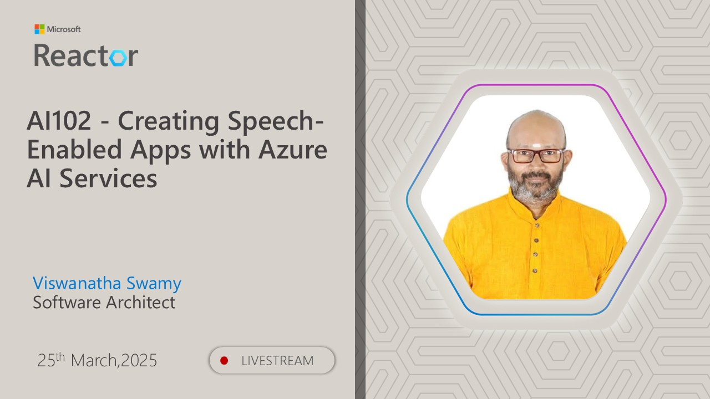

# AI-102 - Creating Speech-Enabled Apps with Azure AI Services

## Date Time: 25-Mar-2025 at 03:30 PM IST

## Event URL: [https://www.meetup.com/microsoft-reactor-bengaluru/events/306320052](https://www.meetup.com/microsoft-reactor-bengaluru/events/306320052)

## YouTube URL: [https://www.youtube.com/watch?v=\_oBotkrgZQk](https://www.youtube.com/watch?v=_oBotkrgZQk)

---

### Software/Tools

> 1. OS: Windows 10/11 x64
> 1. Python / .NET 8
> 1. Visual Studio 2022
> 1. Visual Studio Code

### Prior Knowledge

> 1. Programming knowledge in C# / Python

## Technology Stack

> 1. .NET 8, AI, Open AI

## Information

## What are we doing today?

> 1. The Big Picture
>    - Pre-requisites
>    - Previous Session(s)
>    - Microsoft Learn Module(s)
> 1. Introduction
> 1. SUMMARY / RECAP / Q&A

### Please refer to the [**Source Code**](https://github.com/Swamy-s-Tech-Skills-Academy/learn-ai-102-code) of today's session for more details

---

---

## 1. The Big Picture

### 1.1. Pre-requisites

> 1. Azure Subscription
> 1. .NET 8 / Python

### 1.2. Previous Session(s)

> 1. <https://youtube.com/playlist?list=PLmsFUfdnGr3wmIh-glyiMkhHS6byEuI59&si=5vlmcUqOuWqFiCRR>

### 1.3. Microsoft Learn Module(s)

> 1. <https://aka.ms/AILanguage>

## 2. Reference(s)

> 1. <https://learn.microsoft.com/en-us/azure/ai-services/speech-service/speech-to-text>

## 3. Introduction

> 1. Azure AI Speech provides powerful APIs for building speech-enabled applications.
> 1. It includes Speech-to-Text, Text-to-Speech, Speech Translation, Speaker Recognition, and Intent Recognition.
> 1. These capabilities help applications understand, process, and generate natural speech.
> 1. Today's session focuses on **speech recognition (Speech-to-Text) and speech synthesis (Text-to-Speech)**.
> 1. Learn how to convert spoken input into text and generate natural-sounding speech output.
> 1. Explore custom voice configurations using Speech Synthesis Markup Language (SSML).
> 1. Azure AI Speech enables interactive voice assistants, automated transcription, and multilingual applications.
> 1. Businesses can leverage these features to improve accessibility, automate workflows, and enhance user experiences.

## 4. Provision an Azure resource for speech

> 1. Discussion and Demo

## 5. Use the Azure AI Speech to Text API

> 1. Discussion and Demo

---

## SUMMARY / RECAP / Q&A

> 1. SUMMARY / RECAP / Q&A
> 2. Any open queries, I will get back through meetup chat/twitter.

---
