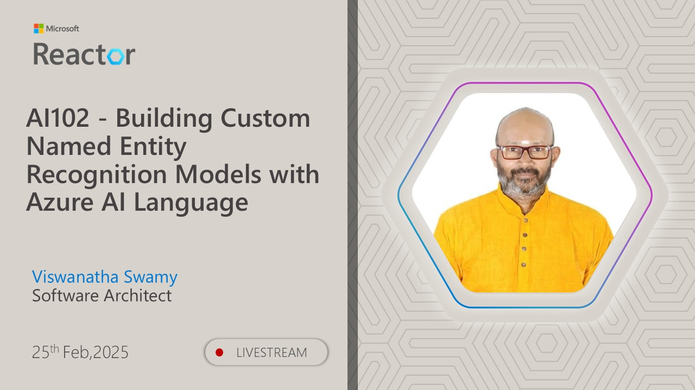

# AI-102 - Building Custom Named Entity Recognition Models with Azure AI Language

## Date Time: 08-Apr-2025 at 03:30 PM IST

## Event URL: [https://www.meetup.com/microsoft-reactor-bengaluru/events/305788277](https://www.meetup.com/microsoft-reactor-bengaluru/events/305788277)

## YouTube URL: [https://www.youtube.com/watch?v=X0GDn-F1zGo](https://www.youtube.com/watch?v=X0GDn-F1zGo)

---

### Software/Tools

> 1. OS: Windows 10/11 x64
> 1. Python / .NET 8
> 1. Visual Studio 2022
> 1. Visual Studio Code

### Prior Knowledge

> 1. Programming knowledge in C# / Python

## Technology Stack

> 1. .NET 8, AI, Open AI

## Information

## What are we doing today?

> 1. The Big Picture
>    - Pre-requisites
>    - Previous Session(s)
>    - Microsoft Learn Module(s)
> 1. Introduction to NER
> 1. Built-in named entity recognition
> 1. Understand custom named entity recognition
> 1. Provision an Azure AI Language resource
> 1. Roles for your user on Storage Account
> 1. Upload sample ads
> 1. Create a custom named entity recognition project
> 1. Label your data
> 1. Train your model
> 1. Evaluate your model
> 1. Deploy your model
> 1. Custom NER capabilities using `C#`
> 1. Custom NER capabilities using `Python`
> 1. SUMMARY / RECAP / Q&A

### Please refer to the [**Source Code**](https://github.com/Swamy-s-Tech-Skills-Academy-AI-ML-Data/learn-ai102) of today's session for more details

---

---

## 1. The Big Picture

### 1.1. Pre-requisites

> 1. Azure Subscription
> 1. .NET 8 / Python

### 1.2. Previous Session(s)

> 1. <https://youtube.com/playlist?list=PLmsFUfdnGr3wmIh-glyiMkhHS6byEuI59&si=5vlmcUqOuWqFiCRR>

### 1.3. Microsoft Learn Module(s)

> 1. <https://aka.ms/Entity-Recognition>

## 2. Introduction to NER

> 1. Discussion and Demo
> 1. <https://learn.microsoft.com/en-gb/training/modules/custom-name-entity-recognition/1-introduction>

## 3. Built-in named entity recognition

> 1. Discussion and Demo
> 1. <https://learn.microsoft.com/en-us/azure/ai-services/language-service/named-entity-recognition/quickstart?tabs=windows%2Cga-api&pivots=rest-api>
> 1. Verifying it in Postman

## 4. Understand custom named entity recognition

> 1. Discussion and Demo
> 1. <https://learn.microsoft.com/en-gb/training/modules/custom-name-entity-recognition/2-understand-custom-named>

## 5. Provision an Azure AI Language resource

> 1. Discussion and Demo

## 6. Roles for your user on Storage Account

> 1. Discussion and Demo

## 7. Upload sample ads

> 1. Discussion and Demo

## 8. Create a custom named entity recognition project

> 1. Discussion and Demo

## 9. Label your data

> 1. Discussion and Demo

## 10. Train your model

> 1. Discussion and Demo

## 11. Evaluate your model

> 1. Discussion and Demo

## 12. Deploy your model

> 1. Discussion and Demo

## 13. Custom NER capabilities using `C#`

> 1. Discussion and Demo

---

## SUMMARY / RECAP / Q&A

> 1. SUMMARY / RECAP / Q&A
> 2. Any open queries, I will get back through meetup chat/twitter.

---
