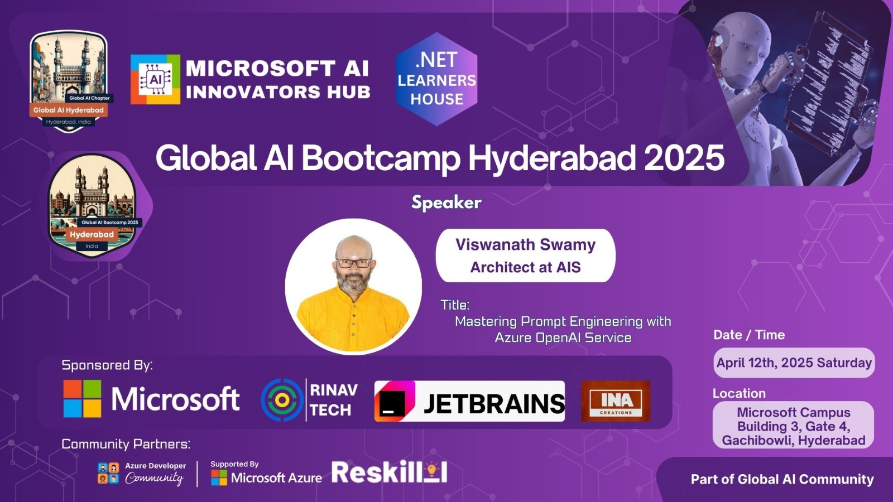

# Global AI Bootcamp 2025 Hyderabad - 1 March 2025

## Date Time: 01-Mar-2025 at 09:30 AM IST

## Event URL: [https://www.meetup.com/global-ai-hyderabad/events/305665213](https://www.meetup.com/global-ai-hyderabad/events/305665213)

---

### Software/Tools

> 1. OS: Windows 10/11 x64
> 1. Python / .NET 8
> 1. Visual Studio 2022
> 1. Visual Studio Code

### Prior Knowledge

> 1. Programming knowledge in C# / Python

## Technology Stack

> 1. .NET 8, AI, Open AI

## Information

## What are we doing today?

> 1. The Big Picture
> 1. Quick Introduction
> 1. Live Demo (25 min) – Hands-on Walkthrough
>    - Setup & Running eShopSupport Locally (5 min)
>    - Exploring AI-Powered Features (15 min)
>    - Extending the AI Capabilities (5 min)
> 1. SUMMARY / RECAP / Q&A

### Please refer to the [**Source Code**](https://github.com/Swamy-s-Tech-Skills-Academy/learn-ai-102-code) of today's session for more details

---

---

## Keynote - Mar-2025: From a Developer's Perspective

### Our Progress Over Time

> 1. A visual journey: from black-and-white screens to modern IDEs with advanced syntax highlighting.

### GitHub Copilot in Action

> 1. How it generates code and helps us understand our code better.

### Expanding AI Use Cases

> 1. Leveraging AI for Development, Media, DevOps, Customer Support, and more.

### Accelerating Work with Chatbots Powered by RAG

> 1. Demonstrating how Retrieval-Augmented Generation (RAG) can speed up workflows.

### Streamlining Our Jobs with AI

> 1. Using AI to simplify tasks while keeping security in focus.

### Automating Repetitive Tasks

> 1. Utilizing batch files, PowerShell scripts, etc., to reduce manual work.

### Getting Started with AI

> 1. Key resources and starting points: [Microsoft AI Developer Resources](https://developer.microsoft.com/en-us/ai).

### Data-Driven Learning in AI

> 1. How AI learns from our data to continuously improve and adapt.

### The Future of AI-Driven Development

> 1. Exploring emerging trends, innovations, and ethical considerations that will shape the next generation of developer tools and practices.
> 1. A look at how the evolving AI landscape will further empower developers, and how we can prepare for these changes.

---

## The Big Picture

> 1. 🔹 Building AI-Powered Customer Support with .NET Aspire & OpenAI

## 1️⃣ Quick Introduction (2-3 min)

> 1. What is `eShopSupport`? (A real-world AI-powered customer support demo)
> 1. Key AI features in the app (`Text Classification, Sentiment Analysis, Summarization, Chatbot`)
> 1. What you’ll see in the live demo

## 2️⃣ Live Demo (25 min) – Hands-on Walkthrough

### 🔹 Setup & Running eShopSupport Locally (5 min)

> 1. Clone the repo & install dependencies
> 1. Run the application using `.NET Aspire`
> 1. Overview of the Aspire Dashboard

### 🔹 Exploring AI-Powered Features (15 min)

> 1. `Text Classification:` Auto-tagging support tickets
> 1. `Sentiment Analysis:` Identifying customer emotions in messages
> 1. `Summarization:` Generating quick insights from long conversations
> 1. `Chatbot Interactions:` AI-powered chat with response suggestions

### 🔹 Extending the AI Capabilities (5 min)

> 1. Running small local AI models vs cloud-based models
> 1. Customizing the AI pipeline for different use cases

## 3️⃣ Wrap-up & Q&A (2-3 min)

> 1. Key takeaways
> 1. Where to explore more & contribute

---

## SUMMARY / RECAP / Q&A

> 1. SUMMARY / RECAP / Q&A
> 2. Any open queries, I will get back through meetup chat/twitter.

---
