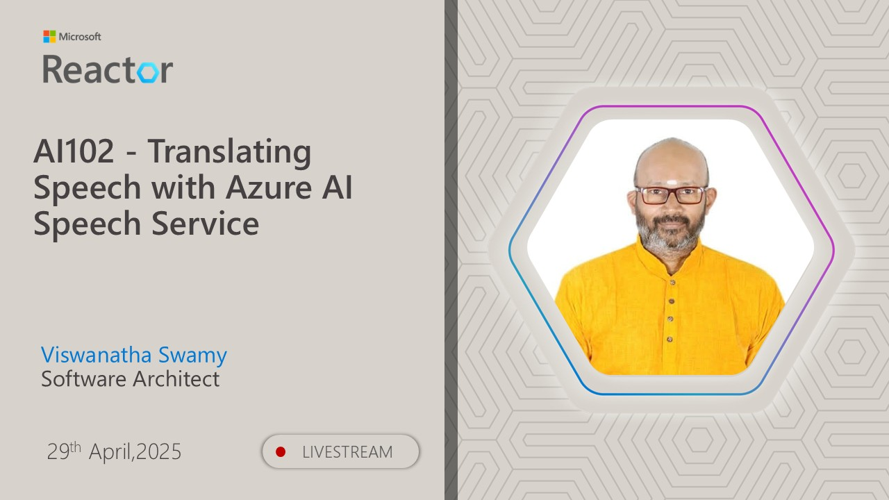
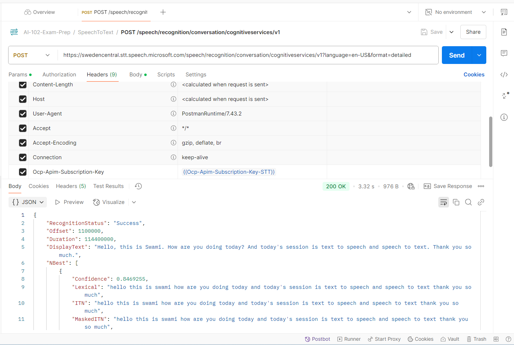

# AI-102 - Translating Speech with Azure AI Speech Service

## Date Time: 29-Apr-2025 at 03:30 PM IST

## Event URL: [https://www.meetup.com/microsoft-reactor-bengaluru/events/307042377](https://www.meetup.com/microsoft-reactor-bengaluru/events/307042377)

## YouTube URL: [https://www.youtube.com/watch?v=fyZwhob8klU](https://www.youtube.com/watch?v=fyZwhob8klU)



---

### Software/Tools

> 1. OS: Windows 10/11 x64
> 2. Python / .NET 8
> 3. Visual Studio 2022
> 4. Visual Studio Code

### Prior Knowledge

> 1. Programming knowledge in C# / Python

## Technology Stack

> 1. .NET 8, AI, Open AI

## Information


## What are we doing today?

> 1. 🔭 The Big Picture
>    - Pre-requisites
>    - Previous Session(s)
>    - Microsoft Learn Module(s)
> 2. 🔊 Introduction
> 3. 🏗️ Provision an Azure resource for speech
> 4. 🗣️ Use the Azure AI Speech to Text API
> 5. 🔈 Use the text to speech API
> 6. 🔄 SUMMARY / RECAP / Q&A

### Please refer to the [**Source Code**](https://github.com/Swamy-s-Tech-Skills-Academy/learn-ai-102-code) of today's session for more details

---


---

## 1. 🔭 The Big Picture

### 1.1. Pre-requisites

> 1. Azure Subscription
> 2. .NET 8 / Python

### 1.2. Previous Session(s)

> 1. <https://youtube.com/playlist?list=PLmsFUfdnGr3wmIh-glyiMkhHS6byEuI59&si=5vlmcUqOuWqFiCRR>

### 1.3. Microsoft Learn Module(s)

> 1. <https://aka.ms/AISpeech-Service>

---

## 2. 🔊 Introduction

Translation of speech builds on speech recognition by recognizing and transcribing spoken input in a specified language, and returning translations of the transcription in one or more other languages.

### What is Azure AI Speech Translation?

Azure AI Speech Translation is a cloud-based service that provides real-time, multi-language translation capabilities for speech and text. It combines advanced speech recognition, machine translation, and speech synthesis technologies to enable seamless communication across language barriers.

### Key Capabilities

- **Real-time Speech-to-Text Translation**: Convert spoken language into text in real-time.
- **Multi-language Support**: Translate between 60+ languages for text and 40+ languages for speech.
- **Custom Voice Development**: Create custom voices that match your brand or specific requirements.
- **Speech Synthesis**: Convert translated text back into natural-sounding speech.
- **Integration Flexibility**: Use REST APIs or client SDKs for various programming languages.

### Why Azure AI Speech Translation?

- **Enhanced Accessibility**: Make content and communications accessible to global audiences.
- **Improved Efficiency**: Automate translation tasks that would otherwise require human translators.
- **Scalability**: Handle translation tasks at scale with Azure's cloud infrastructure.
- **High Accuracy**: Leverage Microsoft's advanced AI models for accurate translations.
- **Security & Compliance**: Benefit from Azure's robust security features and compliance certifications.

### In this session, you'll learn

- How to provision Azure resources for speech translation.
- Techniques for generating text translation from speech.
- Methods for synthesizing spoken translations.
- Practical implementation using Azure AI Speech SDKs.

The session includes important conceptual information about Azure AI Speech and step-by-step guidance on using its APIs through supported SDKs, followed by hands-on exercises to help you gain practical experience with Azure AI Speech translation capabilities.

---

## 3. 🏗️ Provision an Azure resource for speech

> 1. Discussion and Demo

---

## 4. 🗣️ Use the Azure AI Speech to Text API

> 1. Discussion and Demo



---

## 5. 🔈 Use the text to speech API

> 1. Discussion and Demo


### Using `CURL`

```powershell
curl --location --request POST "https://swedencentral.tts.speech.microsoft.com/cognitiveservices/v1" --header "Ocp-Apim-Subscription-Key: $OcpApimSubscriptionKey" --header "Content-Type: application/ssml+xml" --header "X-Microsoft-OutputFormat: audio-16khz-128kbitrate-mono-mp3" --header "User-Agent: curl" --data-raw "<speak version='1.0' xml:lang='en-US'><voice xml:lang='en-US' xml:gender='Female' name='en-US-AvaMultilingualNeural'>my voice is my passport verify me</voice></speak>" --output output.mp3
```


---

## 6. 🔄 SUMMARY / RECAP / Q&A

> 1. SUMMARY / RECAP / Q&A
> 2. Any open queries, I will get back through meetup chat/twitter.

---
