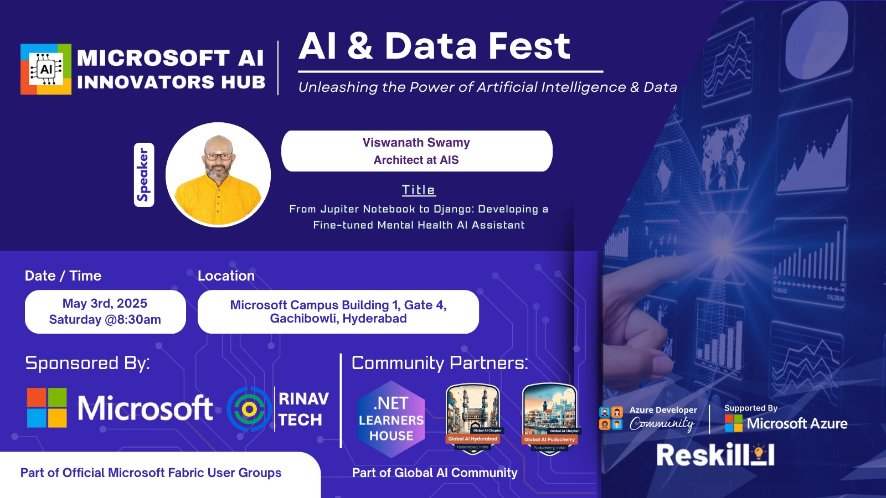
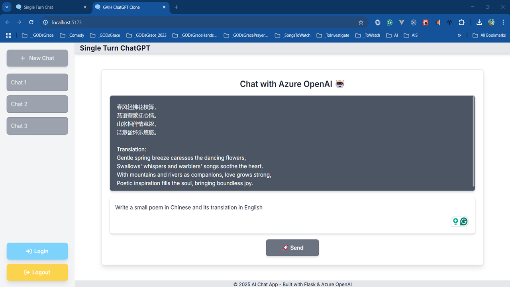
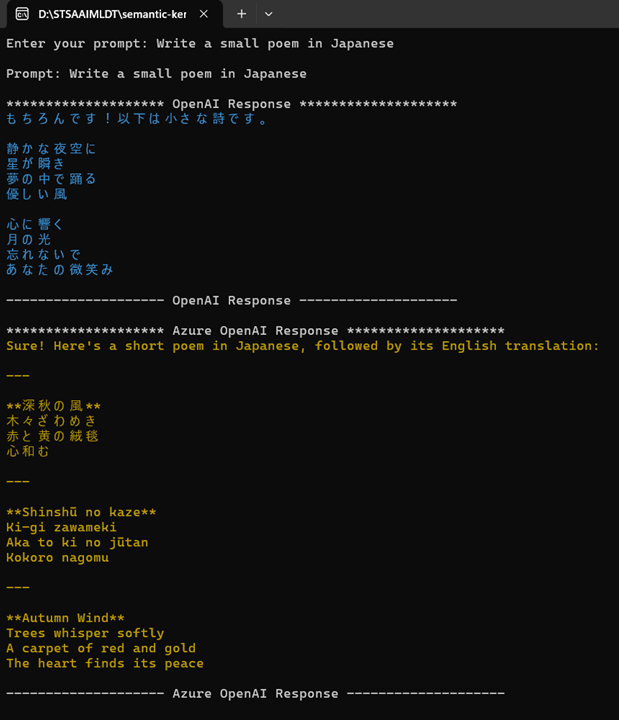
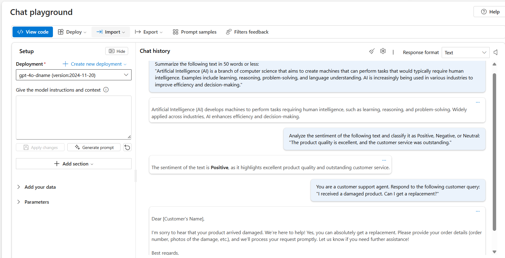
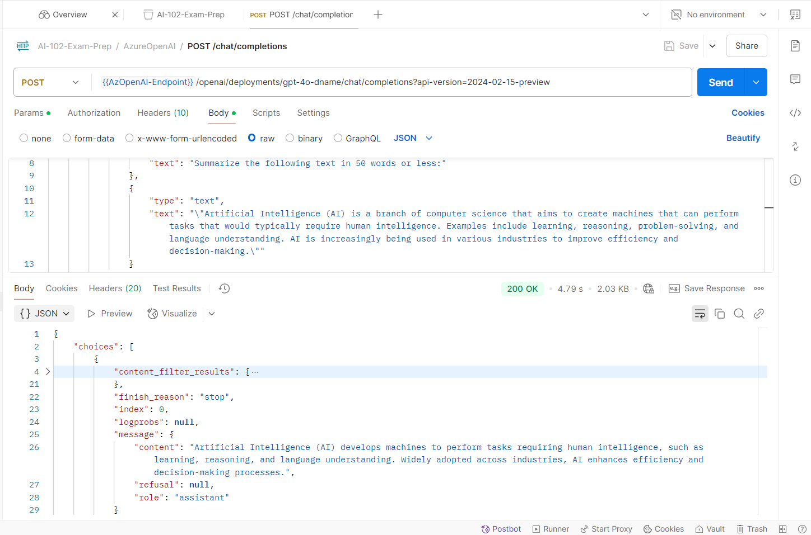
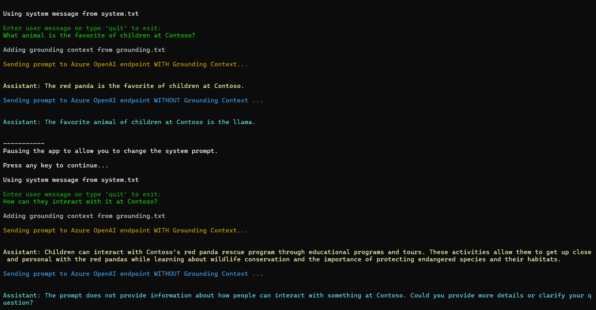

# AI & Data Fest 2025 - 03 May 2025

## Date Time: 03-May-2025 at 09:30 AM IST

## Event URL: [https://www.meetup.com/microsoft-ai/events/306575292](https://www.meetup.com/microsoft-ai/events/306575292)



---

### Software/Tools

> 1. OS: Windows 10/11 x64
> 1. Python / .NET 8
> 1. Visual Studio 2022
> 1. Visual Studio Code

### Prior Knowledge

> 1. Programming knowledge in C# / Python

## Technology Stack

> 1. .NET 8, AI, Open AI

## Information


## What are we doing today?

> 1. The Big Picture
> 1. Mastering Prompt Engineering with Azure OpenAI Service
>    - Importance of prompt engineering in AI applications.
>    - Key strategies for effective prompt design.
>    - Real-world examples of prompt engineering in action.
> 1. 30,000 Foot View of Azure OpenAI
>    - Overview and demonstration of Azure OpenAI Service capabilities.
>    - Understanding service quotas and limitations.
>    - Overview of available models and their use cases.
> 1. Access Azure OpenAI Service
>    - Step-by-step guide to accessing Azure OpenAI Service.
>    - Creating Azure OpenAI resources via Azure Portal and Azure CLI.
> 1. Use Azure OpenAI Foundry
>    - Deploying and managing OpenAI models using Azure OpenAI Foundry.
> 1. Tokens and Their Importance
>    - Understanding tokenization and its impact on AI model performance.
> 1. Techniques in Prompt Engineering
>    - Core techniques: Single Turn, Iterative, Conversational, Role Play, Zero Shot, Single Shot, Few Shots, Chain of Thought (CoT).
> 1. Best Practices for Prompt Engineering
>    - Key guidelines: Be Explicit, Test and Iterate, Leverage Context, Monitor and Adjust.
> 1. Sample Prompts
>    - A collection of sample prompts for demonstration purposes.
> 1. Chat Playground
>    - Hands-on demonstration of interacting with OpenAI models using the chat playground.
> 1. Chat Using APIs and SDKs
>    - Using REST API, C#, and Python to integrate OpenAI models.
> 1. SUMMARY / RECAP / Q&A
>    - Recap of key topics covered.
>    - Open Q&A session for participants.
>    - Follow-up queries will be addressed via meetup chat or Twitter.

### Please refer to the [**Source Code**](https://github.com/Swamy-s-Tech-Skills-Academy/learn-ai-102-code) of today's session for more details

---


---

## Keynote - Apr-2025: From a Developer's Perspective

### Our Progress Over Time

> 1. A visual journey: from black-and-white screens to modern IDEs with advanced syntax highlighting.

### GitHub Copilot in Action

> 1. How it generates code and helps us understand our code better.

### Expanding AI Use Cases

> 1. Leveraging AI for Development, Media, DevOps, Customer Support, and more.

### Accelerating Work with Chatbots Powered by RAG

> 1. Demonstrating how Retrieval-Augmented Generation (RAG) can speed up workflows.

### Streamlining Our Jobs with AI

> 1. Using AI to simplify tasks while keeping security in focus.

### Automating Repetitive Tasks

> 1. Utilizing batch files, PowerShell scripts, etc., to reduce manual work.

### Getting Started with AI

> 1. Key resources and starting points: [Microsoft AI Developer Resources](https://developer.microsoft.com/en-us/ai).

### Data-Driven Learning in AI

> 1. How AI learns from our data to continuously improve and adapt.

### The Future of AI-Driven Development

> 1. Exploring emerging trends, innovations, and ethical considerations that will shape the next generation of developer tools and practices.
> 1. A look at how the evolving AI landscape will further empower developers, and how we can prepare for these changes.

---

## Swamy's Tech Skills Academy - Mentoring Program

[**Swamy's Tech Skills Academy**](https://github.com/Swamy-s-Tech-Skills-Academy-AI-ML-Data) is a platform dedicated to empowering individuals with the skills and knowledge needed to thrive in the tech industry. Our mentoring program focuses on providing personalized guidance and support to help you navigate your career path, enhance your technical skills, and achieve your professional goals.

### Communities and Resources

> 1. [Global AI Hyderabad - Meetup](https://www.meetup.com/global-ai-hyderabad/)
> 2. [Dot Net Learners House - Meetup](https://www.meetup.com/dot-net-learners-house-hyderabad/)
> 3. [Dot Net Learners House - YouTube](https://www.youtube.com/@dotnetlearnershouse7615/streams)

### 1. Python Flask, Open AI, Tailwind CSS

1. Creating a simple web application using Python Flask, OpenAI, and Tailwind CSS.
2. Integrating OpenAI's API for AI-driven features.
3. To learn more, visit the [**GitHub Repo**](https://github.com/Swamy-s-Tech-Skills-Academy-AI-ML-Data/openai-chat-flask)


### 2. React.js, Python Flask, Azure Open AI, Tailwind CSS

1. Creating a simple web application using React.js, Python Flask, Azure OpenAI, and Tailwind CSS.
2. Integrating Azure OpenAI's API for AI-driven features.
3. To learn more, visit the [**GitHub Repo**](https://github.com/Swamy-s-Tech-Skills-Academy-AI-ML-Data/flask-react-aoai-completions).



### 3. .NET 9 Console App, Semantic Kernel, Open AI, Azure Open AI

> 1. Creating a simple console application using .NET 9, Semantic Kernel, OpenAI, and Azure OpenAI.
> 2. Integrating OpenAI's/Azure OpenAI's API for AI-driven features.
> 3. To learn more, visit the [**GitHub Repo**](https://github.com/Swamy-s-Tech-Skills-Academy-AI-ML-Data/semantic-kernel-oai-azoai).



---

## 1. Mastering Prompt Engineering with Azure OpenAI Service

> 1. Discussing the importance of prompt engineering in AI applications.
> 1. Key strategies for effective prompt design.
> 1. Real-world examples of prompt engineering in action.

### Key Takeaways

- **Prompt engineering** is a critical skill for optimizing AI model outputs.
- Effective prompts are clear, specific, and provide necessary context.
- Iterative testing and refinement are essential for success.

---

## 2. 30,000 Foot View of Azure OpenAI

> 1. Overview and demonstration of Azure OpenAI Service capabilities.

### 2.1. What is Azure OpenAI Service?

> 1. Azure OpenAI Service enables developers to integrate advanced AI models into their applications.
> 1. [Learn more](https://learn.microsoft.com/en-us/azure/cognitive-services/openai/overview)

### 2.2. Azure OpenAI Service Quotas and Limits

> 1. Understanding service quotas and limitations.
> 1. [Learn more](https://learn.microsoft.com/en-us/azure/cognitive-services/openai/quotas-limits)

### 2.3. Azure OpenAI Service Models

> 1. Overview of available models and their use cases.
> 1. [Learn more](https://learn.microsoft.com/en-us/azure/cognitive-services/openai/concepts/models)

---

## 3. Access Azure OpenAI Service

> 1. Step-by-step guide to accessing Azure OpenAI Service.

### 3.1. Creating Azure OpenAI Using Azure Portal

> 1. Demonstration of creating Azure OpenAI resources via the Azure Portal.

### 3.2. Creating Azure OpenAI Using Azure CLI

> 1. Demonstration of creating Azure OpenAI resources using Azure CLI.
> 1. [Learn more](https://learn.microsoft.com/en-us/azure/cognitive-services/openai/concepts/models#model-summary-table-and-region-availability/?azure-portal=true)

```powershell
$aoaiName = "azoai-ai102-dev-" + (Get-Random)
$resourceGroup = "rg-ai102-dev-001"
$subscriptionID = "YourSubscriptionId"

az account show

az account list-locations --output table

az cognitiveservices account list --subscription $subscriptionID --output table

az cognitiveservices account create -n $aoaiName -g $resourceGroup -l eastus --kind OpenAI --sku s0 --subscription $subscriptionID
```

---

## 4. Use Azure OpenAI Foundry

> 1. Deploying and managing OpenAI models using Azure OpenAI Foundry.

---

## 5. Tokens and Their Importance

> 1. Understanding tokenization and its impact on AI model performance.
> 1. [Tokenization Tool](https://platform.openai.com/tokenizer)

---

## 6. Techniques in Prompt Engineering

### Core Techniques

- **Single Turn**: Crafting prompts for one-off tasks.
- **Iterative**: Refining prompts through multiple iterations.
- **Conversational**: Maintaining context across multiple interactions.
- **Role Play**: Assigning roles to guide model behavior.
- **Zero Shot**: Providing no examples in the prompt.
- **Single Shot**: Providing one example in the prompt.
- **Few Shots**: Providing multiple examples in the prompt.
- **Chain of Thought (CoT)**: Breaking down problems into logical steps.

---

## 7. Best Practices for Prompt Engineering

### Key Guidelines

- **Be Explicit**: Clearly define the task and expected output.
- **Test and Iterate**: Continuously refine prompts based on results.
- **Leverage Context**: Provide relevant background information.
- **Monitor and Adjust**: Regularly evaluate and tweak prompts.

---

## 8. Sample Prompts

> 1. A collection of sample prompts for demonstration purposes.

### Example Prompts

```text
# Example 1: Summarization Prompt
Summarize the following text in 50 words or less:
"Artificial Intelligence (AI) is a branch of computer science that aims to create machines that can perform tasks that would typically require human intelligence. Examples include learning, reasoning, problem-solving, and language understanding. AI is increasingly being used in various industries to improve efficiency and decision-making."
```

```text
# Example 2: Sentiment Analysis Prompt
Analyze the sentiment of the following text and classify it as Positive, Negative, or Neutral:
"The product quality is excellent, and the customer service was outstanding."
```

```text
# Example 3: Role Play Prompt
You are a customer support agent. Respond to the following customer query:
"I received a damaged product. Can I get a replacement?"
```

```text
# Example 4: Code Generation Prompt
Generate a Python function to calculate the factorial of a number using recursion.
```

```text
# Example 5: Translation Prompt
Translate the following sentence into French:
"The weather is beautiful today."
```

```text
# Example 6: Zero Shot Prompt
What is the capital of France?
```

```text
# Example 7: Single Shot Prompt
Q: What is the capital of France?
A: The capital of France is Paris.

Q: What is the capital of Germany?
```

```text
# Example 8: Few Shots Prompt
Q: What is the capital of France?
A: The capital of France is Paris.

Q: What is the capital of Germany?
A: The capital of Germany is Berlin.

Q: What is the capital of Italy?
```

```text
# Example 9: Chain of Thought (CoT) Prompt
Please solve the following problem using a Chain of Thought (CoT) approach, which involves breaking the problem down into smaller, logical steps to ensure a clear and systematic progression to the solution. Show each intermediate step and explain your reasoning.

Example Problem: "A bakery had 50 cupcakes. They sold 15 in the morning and then baked 20 more in the afternoon. How many cupcakes do they have now?"

**Expected CoT Response:**

1. Start with the initial number of cupcakes: 50.
2. Subtract the number of cupcakes sold in the morning: \( 50 - 15 = 35 \).
3. Add the number of cupcakes baked in the afternoon: \( 35 + 20 = 55 \).
4. The bakery now has 55 cupcakes.

Q: Roger has 5 tennis balls. He buys 2 more cans of tennis balls. Each can has 3 tennis balls. How many tennis balls does he have now?
A: Roger started with 5 balls. 2 cans of 3 tennis balls each is 6 tennis balls. 5 + 6 = 11. The answer is 11.

Q: The cafeteria had 23 apples. If they used 20 to make lunch and bought 6 more, how many apples do they have?
```

```text
# Example 10: Sample Prompt for Social Media Post
Create a Twitter post for "101 Dosa Center". Highlight the following:
- Home-made spices
- Generous use of butter
- Dosas made with love
- Keep the tone warm and inviting.

Example:
"Craving something delicious? 🍽️ At 101 Dosa Center, we bring you dosas made with love, home-made spices, and lots of butter! 🧈✨ Taste the tradition in every bite. ❤️ #DosaLovers #FoodieHeaven"
```

````texts
#Example: 11 Blog Post Generation Prompt

Generate a detailed blog post about '{topic}'.
Include an introduction, multiple main sections, optional code snippets, and a conclusion.
Use proper **Markdown syntax** to format each section.

The blog post must include the following Markdown elements:

Headings
# Heading Level 1
## Heading Level 2
### Heading Level 3

Paragraphs
Just write regular text separated by line breaks for paragraphs.

Unordered List
- Item 1
- Item 2
- Item 3

Ordered List
1. First item
2. Second item
3. Third item

Blockquote
> “Experience is simply the name we give our mistakes.”
> — Oscar Wilde

Code Block (JavaScript example)
```js
function helloWorld() {
  console.log(""Hello, world!"");
}
````

---

## 9. Chat Playground

> 1. Hands-on demonstration of interacting with OpenAI models using the chat playground.

## 

## 10. Chat Using APIs and SDKs

### 10.1. Using `REST API`

> 1. Demonstration of integrating OpenAI models via REST API.
> 1. [Quickstart Guide](https://learn.microsoft.com/en-us/azure/ai-services/openai/chatgpt-quickstart)

## 

### 10.2. Using `C#`

> 1. Demonstration of integrating OpenAI models using C#.

```text
You are an AI assistant

Write an intro for a new wildlife Rescue
```

```text
You are an AI assistant helping to write emails

Write a promotional email for a new wildlife rescue, including the following:
- Rescue name is Contoso
- It specializes in elephants
- Call for donations to be given at our website

Write a promotional email for a new wildlife rescue, including the following: - Rescue name is Contoso - It specializes in elephants - Call for donations to be given at our website
```

```text
You are an AI assistant helping to write emails

Write a promotional email for a new wildlife rescue, including the following:
- Rescue name is Contoso
- It specializes in elephants, as well as zebras and giraffes
- Call for donations to be given at our website
\n Include a list of the current animals we have at our rescue after the signature, in the form of a table. These animals include elephants, zebras, gorillas, lizards, and jackrabbits.

Write a promotional email for a new wildlife rescue, including the following: - Rescue name is Contoso - It specializes in elephants, as well as zebras and giraffes - Call for donations to be given at our website \n Include a list of the current animals we have at our rescue after the signature, in the form of a table. These animals include elephants, zebras, gorillas, lizards, and jackrabbits.
```

```text
You are an AI assistant that helps write promotional emails to generate interest in a new business. Your tone is light, chit-chat oriented and you always include at least two jokes.

Write a promotional email for a new wildlife rescue, including the following:
- Rescue name is Contoso
- It specializes in elephants, as well as zebras and giraffes
- Call for donations to be given at our website
\n Include a list of the current animals we have at our rescue after the signature, in the form of a table. These animals include elephants, zebras, gorillas, lizards, and jackrabbits.

Write a promotional email for a new wildlife rescue, including the following: - Rescue name is Contoso - It specializes in elephants, as well as zebras and giraffes - Call for donations to be given at our website \n Include a list of the current animals we have at our rescue after the signature, in the form of a table. These animals include elephants, zebras, gorillas, lizards, and jackrabbits.
```


#### Sending the Grounded Context

```text
You're an AI assistant who helps people find information. You'll provide answers from the text provided in the prompt, and respond concisely.

What animal is the favorite of children at Contoso?

How can they interact with it at Contoso?
```



### 10.3. Using `Python`

> 1. Demonstration of integrating OpenAI models using `Python`.

## SUMMARY / RECAP / Q&A

> 1. Recap of key topics covered.
> 2. Open Q&A session for participants.
> 3. Follow-up queries will be addressed via meetup chat or Twitter.

---
