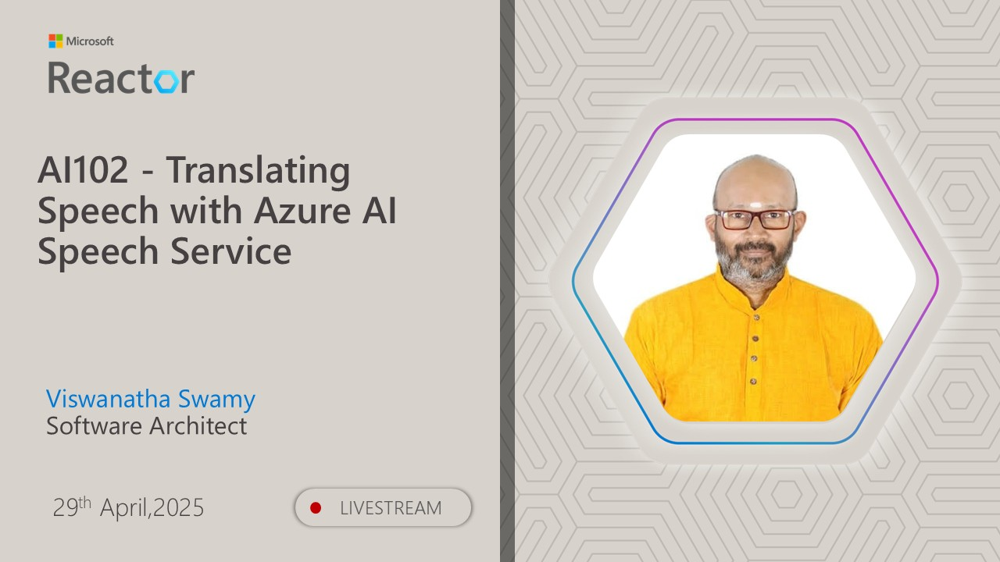

# AI-102 - Implementing Custom Skills in Azure AI Search

## Date Time: 27-May-2025 at 03:30 PM IST

## Event URL: [https://www.meetup.com/microsoft-reactor-bengaluru/events/307082897](https://www.meetup.com/microsoft-reactor-bengaluru/events/307082897)

## YouTube URL: [https://www.youtube.com/watch?v=AIMWCLCpu4Q](https://www.youtube.com/watch?v=AIMWCLCpu4Q)



---

### Software/Tools

> 1. OS: Windows 10/11 x64
> 2. Python / .NET 8
> 3. Visual Studio 2022
> 4. Visual Studio Code

### Prior Knowledge

> 1. Programming knowledge in C# / Python

## Technology Stack

> 1. .NET 8, AI, Open AI

## Information


## What are we doing today?

> 1. 🔭 The Big Picture
>    - Pre-requisites
>    - Previous Session(s)
>    - Microsoft Learn Module(s)
> 2. 🔊 Introduction to Custom Skills
> 3. 🛠️ Define the custom skill schema
> 4. ➕ Add a custom skill to a skillset
> 5. 🔤 Create a custom text classification skill
> 6. 🤖 Build a machine learning custom skill
> 7. 🧪 Hands-on Exercise - Create a Custom Skill
> 8. 🔄 SUMMARY / RECAP / Q&A

### Please refer to the [**Source Code**](https://github.com/Swamy-s-Tech-Skills-Academy-AI-ML-Data/learn-ai102) of today's session for more details

---


---

## 1. 🔭 The Big Picture

### 1.1. Pre-requisites

> 1. Azure Subscription
> 2. .NET 8 / Python

### 1.2. Previous Session(s)

> 1. <https://youtube.com/playlist?list=PLmsFUfdnGr3wmIh-glyiMkhHS6byEuI59&si=5vlmcUqOuWqFiCRR>

### 1.3. Microsoft Learn Module(s)

> 1. <https://learn.microsoft.com/azure/search/cognitive-search-create-custom-skill-example>
> 2. <https://learn.microsoft.com/azure/search/cognitive-search-custom-skill-interface>
> 3. <https://learn.microsoft.com/azure/search/cognitive-search-custom-skill-scale>

---

## 2. 🔊 Introduction to Custom Skills

Custom skills in Azure AI Search enable you to extend the AI enrichment pipeline with your own processing logic. When built-in cognitive skills don't meet your specific requirements, custom skills allow you to:

- Implement domain-specific processing
- Integrate with external APIs and services
- Add machine learning models for specialized tasks
- Create custom text analysis and classification

### Why Custom Skills?

**Problem**: Built-in cognitive skills may not cover all your business requirements.

**Example**: A legal firm needs to classify contracts by type, extract specific legal clauses, or redact sensitive information - capabilities not available in standard cognitive skills.

**Solution**: Custom skills bridge this gap by allowing you to implement any processing logic that can accept JSON input and return JSON output.

### Custom Skill Types

1. **Web API Custom Skills**: REST endpoints that process enrichment data
2. **Azure Function Custom Skills**: Serverless compute for lightweight processing
3. **Machine Learning Custom Skills**: Integration with Azure ML models
4. **Text Classification Skills**: Custom NLP processing

## 3. 🛠️ Define the custom skill schema

Custom skills must implement a specific input/output contract to integrate with Azure AI Search enrichment pipelines.

### Input Schema

```json
{
  "values": [
    {
      "recordId": "record1",
      "data": {
        "text": "Sample text to process",
        "languageCode": "en"
      }
    }
  ]
}
```

### Output Schema

```json
{
  "values": [
    {
      "recordId": "record1",
      "data": {
        "processedText": "Processed result",
        "confidence": 0.95
      },
      "errors": [],
      "warnings": []
    }
  ]
}
```

### Key Requirements

- **recordId**: Must match input recordId for correlation
- **data**: Contains the enriched fields your skill produces
- **errors**: Array of error messages (if any)
- **warnings**: Array of warning messages (optional)

## 4. ➕ Add a custom skill to a skillset

### Step 1: Create the Custom Skill Definition

```json
{
  "@odata.type": "#Microsoft.Skills.Custom.WebApiSkill",
  "name": "customTextClassifier",
  "description": "Custom skill to classify document type",
  "uri": "https://your-function-app.azurewebsites.net/api/classify",
  "httpMethod": "POST",
  "timeout": "PT30S",
  "context": "/document",
  "batchSize": 10,
  "inputs": [
    {
      "name": "text",
      "source": "/document/content"
    },
    {
      "name": "languageCode",
      "source": "/document/languageCode"
    }
  ],
  "outputs": [
    {
      "name": "category",
      "targetName": "documentCategory"
    },
    {
      "name": "confidence",
      "targetName": "categoryConfidence"
    }
  ]
}
```

### Step 2: Add to Skillset

```json
{
  "name": "document-processing-skillset",
  "description": "Skillset with custom classification",
  "skills": [
    {
      "@odata.type": "#Microsoft.Skills.Text.LanguageDetectionSkill",
      "context": "/document",
      "inputs": [
        {
          "name": "text",
          "source": "/document/content"
        }
      ],
      "outputs": [
        {
          "name": "languageCode",
          "targetName": "languageCode"
        }
      ]
    },
    {
      "@odata.type": "#Microsoft.Skills.Custom.WebApiSkill",
      "name": "customTextClassifier",
      "description": "Custom skill to classify document type",
      "uri": "https://your-function-app.azurewebsites.net/api/classify",
      "httpMethod": "POST",
      "timeout": "PT30S",
      "context": "/document",
      "inputs": [
        {
          "name": "text",
          "source": "/document/content"
        },
        {
          "name": "languageCode",
          "source": "/document/languageCode"
        }
      ],
      "outputs": [
        {
          "name": "category",
          "targetName": "documentCategory"
        },
        {
          "name": "confidence",
          "targetName": "categoryConfidence"
        }
      ]
    }
  ]
}
```

## 5. 🔤 Create a custom text classification skill

### Azure Function Implementation (C#)

```csharp
using Microsoft.AspNetCore.Http;
using Microsoft.AspNetCore.Mvc;
using Microsoft.Azure.WebJobs;
using Microsoft.Azure.WebJobs.Extensions.Http;
using Microsoft.Extensions.Logging;
using Newtonsoft.Json;
using System.Collections.Generic;
using System.IO;
using System.Threading.Tasks;

public static class TextClassificationSkill
{
    [FunctionName("classify")]
    public static async Task<IActionResult> Run(
        [HttpTrigger(AuthorizationLevel.Function, "post", Route = null)] HttpRequest req,
        ILogger log)
    {
        log.LogInformation("Custom text classification skill triggered.");

        string requestBody = await new StreamReader(req.Body).ReadToEndAsync();
        var request = JsonConvert.DeserializeObject<CustomSkillRequest>(requestBody);

        var response = new CustomSkillResponse
        {
            Values = new List<CustomSkillResponseRecord>()
        };

        foreach (var record in request.Values)
        {
            var outputRecord = new CustomSkillResponseRecord
            {
                RecordId = record.RecordId,
                Data = new Dictionary<string, object>()
            };

            try
            {
                string text = record.Data.ContainsKey("text") ? record.Data["text"].ToString() : "";
                
                // Simple classification logic (replace with your ML model)
                var classification = ClassifyText(text);
                
                outputRecord.Data["category"] = classification.Category;
                outputRecord.Data["confidence"] = classification.Confidence;
            }
            catch (Exception ex)
            {
                outputRecord.Errors = new List<string> { ex.Message };
            }

            response.Values.Add(outputRecord);
        }

        return new OkObjectResult(response);
    }

    private static (string Category, double Confidence) ClassifyText(string text)
    {
        // Simple keyword-based classification
        text = text.ToLower();
        
        if (text.Contains("contract") || text.Contains("agreement"))
            return ("Legal Document", 0.85);
        else if (text.Contains("invoice") || text.Contains("bill"))
            return ("Financial Document", 0.90);
        else if (text.Contains("policy") || text.Contains("procedure"))
            return ("Policy Document", 0.80);
        else
            return ("General Document", 0.50);
    }
}

// Data models
public class CustomSkillRequest
{
    public List<CustomSkillRequestRecord> Values { get; set; }
}

public class CustomSkillRequestRecord
{
    public string RecordId { get; set; }
    public Dictionary<string, object> Data { get; set; }
}

public class CustomSkillResponse
{
    public List<CustomSkillResponseRecord> Values { get; set; }
}

public class CustomSkillResponseRecord
{
    public string RecordId { get; set; }
    public Dictionary<string, object> Data { get; set; }
    public List<string> Errors { get; set; } = new List<string>();
    public List<string> Warnings { get; set; } = new List<string>();
}
```

### Python Implementation

```python
import json
import logging
import azure.functions as func

def main(req: func.HttpRequest) -> func.HttpResponse:
    logging.info('Custom text classification skill triggered.')

    try:
        req_body = req.get_json()
        
        response = {
            "values": []
        }

        for record in req_body.get("values", []):
            record_id = record.get("recordId")
            text = record.get("data", {}).get("text", "")
            
            # Simple classification logic
            category, confidence = classify_text(text)
            
            output_record = {
                "recordId": record_id,
                "data": {
                    "category": category,
                    "confidence": confidence
                },
                "errors": [],
                "warnings": []
            }
            
            response["values"].append(output_record)

        return func.HttpResponse(
            json.dumps(response),
            mimetype="application/json",
            status_code=200
        )

    except Exception as e:
        logging.error(f"Error processing request: {str(e)}")
        return func.HttpResponse(
            json.dumps({"error": str(e)}),
            status_code=500
        )

def classify_text(text):
    """Simple keyword-based text classification"""
    text_lower = text.lower()
    
    if any(keyword in text_lower for keyword in ["contract", "agreement", "terms"]):
        return "Legal Document", 0.85
    elif any(keyword in text_lower for keyword in ["invoice", "bill", "payment"]):
        return "Financial Document", 0.90
    elif any(keyword in text_lower for keyword in ["policy", "procedure", "guideline"]):
        return "Policy Document", 0.80
    else:
        return "General Document", 0.50
```

## 6. 🤖 Build a machine learning custom skill

### Integration with Azure ML Model

```csharp
using Microsoft.ML.OnnxRuntime;
using Microsoft.ML.OnnxRuntime.Tensors;

public static class MLCustomSkill
{
    private static InferenceSession _session;
    
    static MLCustomSkill()
    {
        // Initialize ONNX Runtime session with your model
        string modelPath = Environment.GetEnvironmentVariable("MODEL_PATH");
        _session = new InferenceSession(modelPath);
    }

    [FunctionName("mlclassify")]
    public static async Task<IActionResult> Run(
        [HttpTrigger(AuthorizationLevel.Function, "post", Route = null)] HttpRequest req,
        ILogger log)
    {
        var response = new CustomSkillResponse { Values = new List<CustomSkillResponseRecord>() };
        
        try
        {
            string requestBody = await new StreamReader(req.Body).ReadToEndAsync();
            var request = JsonConvert.DeserializeObject<CustomSkillRequest>(requestBody);

            foreach (var record in request.Values)
            {
                var outputRecord = new CustomSkillResponseRecord
                {
                    RecordId = record.RecordId,
                    Data = new Dictionary<string, object>()
                };

                try
                {
                    string text = record.Data["text"].ToString();
                    
                    // Preprocess text (tokenization, vectorization, etc.)
                    var input = PreprocessText(text);
                    
                    // Run ML model inference
                    var results = RunInference(input);
                    
                    outputRecord.Data["prediction"] = results.Prediction;
                    outputRecord.Data["confidence"] = results.Confidence;
                    outputRecord.Data["probabilities"] = results.Probabilities;
                }
                catch (Exception ex)
                {
                    outputRecord.Errors.Add($"Error processing record: {ex.Message}");
                }

                response.Values.Add(outputRecord);
            }
        }
        catch (Exception ex)
        {
            log.LogError($"Error in ML custom skill: {ex.Message}");
            return new StatusCodeResult(500);
        }

        return new OkObjectResult(response);
    }

    private static float[] PreprocessText(string text)
    {
        // Implement your text preprocessing logic
        // This might include tokenization, embedding lookup, etc.
        // Return numerical representation suitable for your ML model
        
        // Placeholder implementation
        return new float[512]; // Assuming 512-dimensional input
    }

    private static (string Prediction, float Confidence, float[] Probabilities) RunInference(float[] input)
    {
        // Create input tensor
        var inputTensor = new DenseTensor<float>(input, new[] { 1, input.Length });
        var inputs = new List<NamedOnnxValue>
        {
            NamedOnnxValue.CreateFromTensor("input", inputTensor)
        };

        // Run inference
        using var results = _session.Run(inputs);
        
        // Extract outputs (adjust based on your model's output format)
        var outputTensor = results.First().AsTensor<float>();
        var probabilities = outputTensor.ToArray();
        
        // Find prediction with highest probability
        int predictedIndex = Array.IndexOf(probabilities, probabilities.Max());
        float confidence = probabilities[predictedIndex];
        
        // Map index to class name (customize based on your classes)
        string[] classNames = { "Class1", "Class2", "Class3" };
        string prediction = classNames[predictedIndex];
        
        return (prediction, confidence, probabilities);
    }
}
```

## 7. 🧪 Hands-on Exercise - Create a Custom Skill

### Exercise Overview
Create a custom skill that extracts and classifies email addresses from documents.

### Step 1: Create Azure Function App

```bash
# Create Resource Group
az group create --name rg-customskill-demo --location eastus

# Create Function App
az functionapp create \
  --resource-group rg-customskill-demo \
  --consumption-plan-location eastus \
  --runtime dotnet \
  --functions-version 4 \
  --name func-emailextractor-demo \
  --storage-account stcustomskilldemo
```

### Step 2: Implement Email Extraction Function

```csharp
using System.Text.RegularExpressions;

public static class EmailExtractionSkill
{
    [FunctionName("extractemail")]
    public static async Task<IActionResult> Run(
        [HttpTrigger(AuthorizationLevel.Function, "post", Route = null)] HttpRequest req,
        ILogger log)
    {
        string requestBody = await new StreamReader(req.Body).ReadToEndAsync();
        var request = JsonConvert.DeserializeObject<CustomSkillRequest>(requestBody);

        var response = new CustomSkillResponse { Values = new List<CustomSkillResponseRecord>() };

        foreach (var record in request.Values)
        {
            var outputRecord = new CustomSkillResponseRecord
            {
                RecordId = record.RecordId,
                Data = new Dictionary<string, object>()
            };

            try
            {
                string text = record.Data["text"].ToString();
                var emails = ExtractEmails(text);
                var classification = ClassifyEmails(emails);

                outputRecord.Data["emails"] = emails;
                outputRecord.Data["emailCount"] = emails.Count;
                outputRecord.Data["domains"] = emails.Select(e => e.Split('@')[1]).Distinct().ToList();
                outputRecord.Data["hasBusinessEmail"] = classification.HasBusinessEmail;
                outputRecord.Data["hasPersonalEmail"] = classification.HasPersonalEmail;
            }
            catch (Exception ex)
            {
                outputRecord.Errors.Add(ex.Message);
            }

            response.Values.Add(outputRecord);
        }

        return new OkObjectResult(response);
    }

    private static List<string> ExtractEmails(string text)
    {
        var emailPattern = @"\b[A-Za-z0-9._%+-]+@[A-Za-z0-9.-]+\.[A-Z|a-z]{2,}\b";
        var matches = Regex.Matches(text, emailPattern);
        return matches.Cast<Match>().Select(m => m.Value.ToLower()).Distinct().ToList();
    }

    private static (bool HasBusinessEmail, bool HasPersonalEmail) ClassifyEmails(List<string> emails)
    {
        var personalDomains = new HashSet<string> { "gmail.com", "yahoo.com", "hotmail.com", "outlook.com" };
        
        bool hasPersonal = emails.Any(email => 
            personalDomains.Contains(email.Split('@')[1]));
        
        bool hasBusiness = emails.Any(email => 
            !personalDomains.Contains(email.Split('@')[1]));
        
        return (hasBusiness, hasPersonal);
    }
}
```

### Step 3: Add Custom Skill to Skillset

```json
{
  "@odata.type": "#Microsoft.Skills.Custom.WebApiSkill",
  "name": "emailExtractor",
  "description": "Extract and classify email addresses",
  "uri": "https://func-emailextractor-demo.azurewebsites.net/api/extractemail",
  "httpMethod": "POST",
  "timeout": "PT30S",
  "context": "/document",
  "inputs": [
    {
      "name": "text",
      "source": "/document/content"
    }
  ],
  "outputs": [
    {
      "name": "emails",
      "targetName": "extractedEmails"
    },
    {
      "name": "emailCount",
      "targetName": "emailCount"
    },
    {
      "name": "domains",
      "targetName": "emailDomains"
    },
    {
      "name": "hasBusinessEmail",
      "targetName": "containsBusinessEmail"
    },
    {
      "name": "hasPersonalEmail",
      "targetName": "containsPersonalEmail"
    }
  ]
}
```

### Step 4: Update Index Schema

```json
{
  "fields": [
    {
      "name": "id",
      "type": "Edm.String",
      "key": true,
      "searchable": false
    },
    {
      "name": "content",
      "type": "Edm.String",
      "searchable": true,
      "analyzer": "standard.lucene"
    },
    {
      "name": "extractedEmails",
      "type": "Collection(Edm.String)",
      "searchable": true,
      "filterable": true,
      "facetable": true
    },
    {
      "name": "emailCount",
      "type": "Edm.Int32",
      "filterable": true,
      "sortable": true,
      "facetable": true
    },
    {
      "name": "emailDomains",
      "type": "Collection(Edm.String)",
      "filterable": true,
      "facetable": true
    },
    {
      "name": "containsBusinessEmail",
      "type": "Edm.Boolean",
      "filterable": true,
      "facetable": true
    },
    {
      "name": "containsPersonalEmail",
      "type": "Edm.Boolean",
      "filterable": true,
      "facetable": true
    }
  ]
}
```

### Step 5: Query with Custom Enrichments

```bash
# Search for documents with business emails
curl -X GET "https://your-search-service.search.windows.net/indexes/your-index/docs?api-version=2021-04-30-Preview" \
  -H "api-key: your-api-key" \
  --data-urlencode "search=*" \
  --data-urlencode "\$filter=containsBusinessEmail eq true" \
  --data-urlencode "facet=emailDomains"

# Search for documents with multiple emails
curl -X GET "https://your-search-service.search.windows.net/indexes/your-index/docs?api-version=2021-04-30-Preview" \
  -H "api-key: your-api-key" \
  --data-urlencode "search=*" \
  --data-urlencode "\$filter=emailCount gt 2" \
  --data-urlencode "\$orderby=emailCount desc"
```

## Best Practices for Custom Skills

### Performance Optimization

1. **Batch Processing**: Process multiple records in a single request
2. **Caching**: Cache expensive computations or model predictions
3. **Async Processing**: Use async/await for I/O operations
4. **Connection Pooling**: Reuse HTTP connections and database connections

### Error Handling

```csharp
try
{
    // Process record
    var result = ProcessText(text);
    outputRecord.Data["result"] = result;
}
catch (ArgumentException ex)
{
    outputRecord.Errors.Add($"Invalid input: {ex.Message}");
}
catch (TimeoutException ex)
{
    outputRecord.Warnings.Add($"Processing timeout: {ex.Message}");
    outputRecord.Data["result"] = "timeout";
}
catch (Exception ex)
{
    outputRecord.Errors.Add($"Unexpected error: {ex.Message}");
    log.LogError(ex, "Error processing record {RecordId}", record.RecordId);
}
```

### Security Considerations

1. **Authentication**: Use managed identity or secure API keys
2. **Input Validation**: Validate and sanitize all inputs
3. **Rate Limiting**: Implement rate limiting to prevent abuse
4. **Logging**: Log security-relevant events without exposing sensitive data

---

## 8. 🔄 SUMMARY / RECAP / Q&A

> 1. SUMMARY / RECAP / Q&A
> 2. Any open queries, I will get back through meetup chat/twitter.

---
