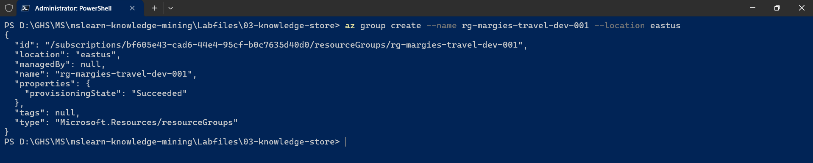
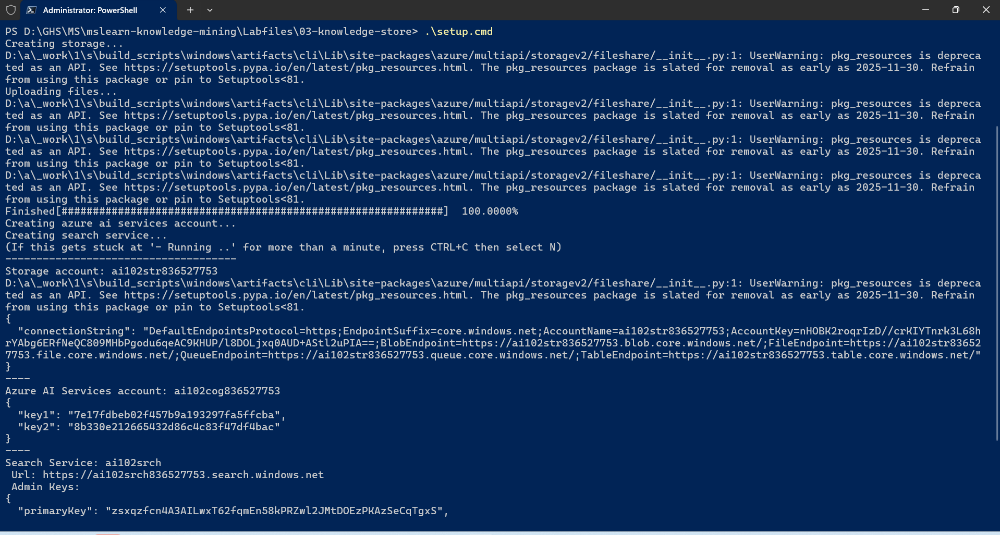
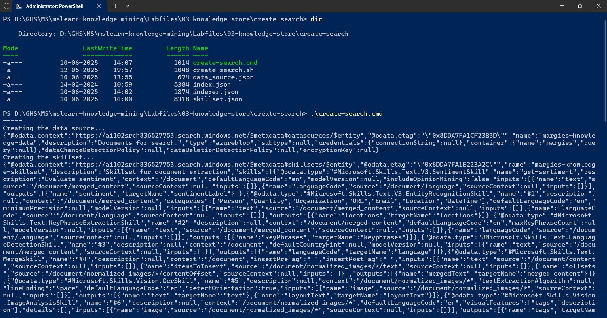

# AI-102 - Creating a Knowledge Store with Azure AI Search

## Date Time: 10-Jun-2025 at 03:30 PM IST

## Event URL: [https://www.meetup.com/microsoft-reactor-bengaluru/events/307800670](https://www.meetup.com/microsoft-reactor-bengaluru/events/307800670)

## YouTube URL: [https://www.youtube.com/watch?v=Ds9kQmWKRBU](https://www.youtube.com/watch?v=Ds9kQmWKRBU)


---

### Software/Tools

> 1. OS: Windows 10/11 x64
> 2. Python / .NET 8
> 3. Visual Studio 2022
> 4. Visual Studio Code

### Prior Knowledge

> 1. Programming knowledge in C# / Python

## Technology Stack

> 1. .NET 8, AI, Open AI

## Information


## What are we doing today?

> 1. 🔭 The Big Picture
>    - Pre-requisites
>    - Previous Session(s)
>    - Microsoft Learn Module(s)
> 2. 🔄 SUMMARY / RECAP / Q&A

### Please refer to the [**Source Code**](https://github.com/Swamy-s-Tech-Skills-Academy-AI-ML-Data/learn-ai102) of today's session for more details

---


---

## 1. 🔭 The Big Picture

### 1.1. Pre-requisites

> 1. Azure Subscription
> 2. .NET 8 / Python

### 1.2. Previous Session(s)

> 1. <https://youtube.com/playlist?list=PLmsFUfdnGr3wmIh-glyiMkhHS6byEuI59&si=5vlmcUqOuWqFiCRR>

### 1.3. Microsoft Learn Module(s)

> 1. <https://aka.ms/Azure-AISearch>

## 2. 🔍 Introduction to Knowledge Stores

Azure AI Search enriches data using AI skills (language detection, key phrases, sentiment analysis, entity recognition, OCR) and stores results in an index for comprehensive search beyond basic text search.

### 🗄️ What are Knowledge Stores?

`Knowledge stores` extend enriched data beyond the search index for:

- `Data Integration`: Export as JSON files for Azure Data Factory
- `Analytics`: Normalize into tables for Power BI reporting
- `File Storage`: Save extracted images as files

### 🏗️ Projections

Knowledge stores consist of `projections` of enriched data:

1. `JSON Objects` - Data integration
2. `Tables` - Relational analysis
3. `Image Files` - Extracted media

## 3. 🎯 Define Projections

Projections define how enriched data is stored in your knowledge store. Each skill builds a JSON document, and you can persist fields as projections.

### 🔧 Using the Shaper Skill

The **Shaper skill** simplifies complex documents into well-formed structures for knowledge store projections.

**Example Shaper Skill:**

```json
{
  "@odata.type": "#Microsoft.Skills.Util.ShaperSkill",
  "name": "define-projection",
  "context": "/document",
  "inputs": [
    { "name": "file_name", "source": "/document/metadata_content_name" },
    { "name": "sentiment", "source": "/document/sentimentScore" },
    { "name": "key_phrases", "source": "/document/keyphrases" }
  ],
  "outputs": [{ "name": "output", "targetName": "projection" }]
}
```

**Resulting Structure:**

```json
{
  "file_name": "travel_brochure.pdf",
  "sentiment": 0.85,
  "key_phrases": ["luxury hotel", "beach resort", "customer review"]
}
```

## 4. 🗄️ Define Knowledge Store

Create a **knowledgeStore** object in your skillset to specify Azure Storage connection and projection definitions.

### 📋 Projection Types

Each projection type must be defined separately:

```json
{
  "knowledgeStore": {
    "storageConnectionString": "<storage_connection_string>",
    "projections": [
      {
        "objects": [
          { "storageContainer": "travel-docs", "source": "/projection" }
        ],
        "tables": [],
        "files": []
      },
      {
        "objects": [],
        "tables": [
          {
            "tableName": "TravelDocs",
            "generatedKeyName": "doc_id",
            "source": "/projection"
          },
          {
            "tableName": "KeyPhrases",
            "generatedKeyName": "phrase_id",
            "source": "/projection/key_phrases/*"
          }
        ],
        "files": []
      },
      {
        "objects": [],
        "tables": [],
        "files": [
          {
            "storageContainer": "travel-images",
            "source": "/document/normalized_images/*"
          }
        ]
      }
    ]
  }
}
```

### 🔗 Key Benefits

- **Containers**: Created automatically if they don't exist
- **Tables**: Include unique keys for relational joins
- **Analysis**: Enable Power BI reporting and data integration

## 5. 🎯 Session Goals

In this hands-on session, we'll implement a knowledge store for **Margie's Travel** using Azure AI Search. You will learn to:

### Create Azure Resources

```powershell
 az account list-locations -o table

az group create --name rg-margies-travel-dev-001 --location eastus
```





### Create a search solution

> 1. A data source that references the documents in your Azure storage container.
> 1. A skillset that defines an enrichment pipeline of skills to extract AI-generated fields from the documents. The skillset also defines the projections that will be generated in your knowledge store.
> 1. An index that defines a searchable set of document records.
> 1. An indexer that extracts the documents from the data source, applies the skillset, and populates the index. The process of indexing also persists the projections defined in the skillset in the knowledge store.



### 🏗️ Build the Complete Pipeline

✅ **Create Azure Resources** - Storage account, AI Services, and Search service  
✅ **Configure Data Source** - Connect to travel documents in blob storage  
✅ **Design Skillset** - Define AI enrichment pipeline with knowledge store projections  
✅ **Build Search Index** - Create searchable document structure  
✅ **Run Indexer** - Execute the pipeline to populate index and knowledge store

### 📊 Explore Knowledge Store Projections

✅ **Object Projections** - View JSON files with enriched travel document data  
✅ **File Projections** - Access extracted images from travel brochures  
✅ **Table Projections** - Query relational schema for analytics and reporting

### 🔍 Analyze Enriched Data

✅ **Document Insights** - Language detection, sentiment analysis, key phrases  
✅ **Location Extraction** - Identify travel destinations and landmarks  
✅ **Image Processing** - Extract and tag images from travel materials  
✅ **Power BI Integration** - Connect relational projections for business intelligence

### 🛠️ Hands-on Experience

✅ **REST API Usage** - Submit JSON definitions via Azure AI Search REST interface  
✅ **Azure Portal Navigation** - Monitor indexing progress and explore results  
✅ **Storage Explorer** - Browse containers, tables, and projection outputs  
✅ **Troubleshooting** - Debug common indexing and projection issues

---

## 8. 🔄 SUMMARY / RECAP / Q&A

> 1. SUMMARY / RECAP / Q&A
> 2. Any open queries, I will get back through meetup chat/twitter.

---
