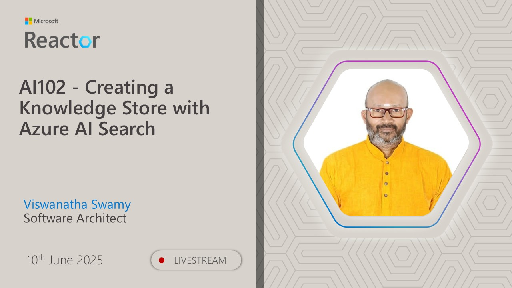

# AI-102 - Creating a Knowledge Store with Azure AI Search

## Date Time: 10-Jun-2025 at 03:30 PM IST

## Event URL: [https://www.meetup.com/microsoft-reactor-bengaluru/events/307800670](https://www.meetup.com/microsoft-reactor-bengaluru/events/307800670)

## YouTube URL: [https://www.youtube.com/watch?v=Ds9kQmWKRBU](https://www.youtube.com/watch?v=Ds9kQmWKRBU)



---

### Software/Tools

> 1. OS: Windows 10/11 x64
> 2. Python / .NET 8
> 3. Visual Studio 2022
> 4. Visual Studio Code

### Prior Knowledge

> 1. Programming knowledge in C# / Python

## Technology Stack

> 1. .NET 8, AI, Open AI

## Information


## What are we doing today?

> 1. 🔭 The Big Picture
>    - Pre-requisites
>    - Previous Session(s)
>    - Microsoft Learn Module(s)
> 2. 🔄 SUMMARY / RECAP / Q&A

### Please refer to the [**Source Code**](https://github.com/Swamy-s-Tech-Skills-Academy-AI-ML-Data/learn-ai102) of today's session for more details

---


---

## 1. 🔭 The Big Picture

### 1.1. Pre-requisites

> 1. Azure Subscription
> 2. .NET 8 / Python

### 1.2. Previous Session(s)

> 1. <https://youtube.com/playlist?list=PLmsFUfdnGr3wmIh-glyiMkhHS6byEuI59&si=5vlmcUqOuWqFiCRR>

### 1.3. Microsoft Learn Module(s)

> 1. <https://aka.ms/Azure-AISearch>

## 2. 🔍 Introduction to Knowledge Stores

Azure AI Search enriches data using AI skills (language detection, key phrases, sentiment analysis, entity recognition, OCR) and stores results in an index for comprehensive search beyond basic text search.

### 🗄️ What are Knowledge Stores?

`Knowledge stores` extend enriched data beyond the search index for:

- `Data Integration`: Export as JSON files for Azure Data Factory
- `Analytics`: Normalize into tables for Power BI reporting
- `File Storage`: Save extracted images as files

### 🏗️ Projections

Knowledge stores consist of `projections` of enriched data:

1. `JSON Objects` - Data integration
2. `Tables` - Relational analysis
3. `Image Files` - Extracted media

## 3. 🎯 Define Projections

Projections define how enriched data is stored in your knowledge store. Each skill builds a JSON document, and you can persist fields as projections.

### 🔧 Using the Shaper Skill

The **Shaper skill** simplifies complex documents into well-formed structures for knowledge store projections.

**Example Shaper Skill:**

```json
{
  "@odata.type": "#Microsoft.Skills.Util.ShaperSkill",
  "name": "define-projection",
  "context": "/document",
  "inputs": [
    { "name": "file_name", "source": "/document/metadata_content_name" },
    { "name": "sentiment", "source": "/document/sentimentScore" },
    { "name": "key_phrases", "source": "/document/keyphrases" }
  ],
  "outputs": [{ "name": "output", "targetName": "projection" }]
}
```

**Resulting Structure:**

```json
{
  "file_name": "travel_brochure.pdf",
  "sentiment": 0.85,
  "key_phrases": ["luxury hotel", "beach resort", "customer review"]
}
```

This clean structure is easier to map to knowledge store projections than complex nested documents.

### 🎯 Session Goals

Create a knowledge store for **Margie's Travel** to:
✅ Build knowledge store from AI Search pipeline  
✅ View data projections  
✅ Query enriched data

---

## 8. 🔄 SUMMARY / RECAP / Q&A

> 1. SUMMARY / RECAP / Q&A
> 2. Any open queries, I will get back through meetup chat/twitter.

---
