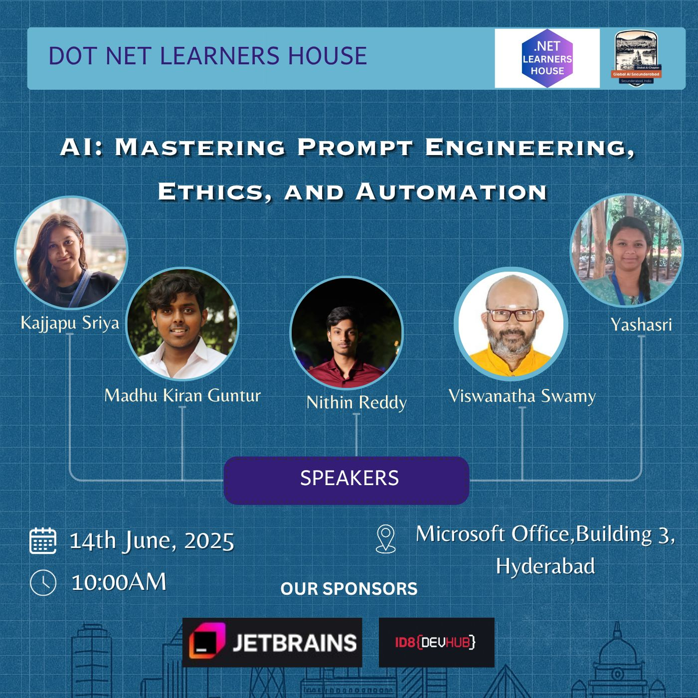

# 📢 AI Agents, Prompt Engineering, GitHub Copilot & .NET Aspire - for Developers

## Date Time: 14-Jun-2025 at 10:00 AM IST

## Event URLs

> 1. DNLH: [https://www.meetup.com/dot-net-learners-house-hyderabad/events/308109558](https://www.meetup.com/dot-net-learners-house-hyderabad/events/308109558)
> 1. GAIS: [https://www.meetup.com/global-ai-secunderabad/events/308326071](https://www.meetup.com/global-ai-secunderabad/events/308326071)

<!-- ## YouTube URL: [https://www.youtube.com/watch?v=AIMWCLCpu4Q](https://www.youtube.com/watch?v=AIMWCLCpu4Q) -->

---

### Software/Tools

> 1. OS: Windows 10/11 x64
> 2. Python / .NET 8
> 3. Visual Studio 2022
> 4. Visual Studio Code

### Prior Knowledge

> 1. Programming knowledge in C# / Python

## Technology Stack

> 1. .NET 8, AI, Open AI

## Information

## What are we doing today?

> 1. 🔭 The Big Picture
>    - Pre-requisites
>    - Previous Session(s)
>    - Microsoft Learn Module(s)
> 2. 🤖 AI Agents for Developers
> 3. 🧠 Prompt Engineering Best Practices
> 4. 🚀 GitHub Copilot in Action
> 5. 🏗️ .NET Aspire for Cloud-Native Development
> 6. 🎯 Keynote - From a Developer's Perspective
> 7. 🛠️ Hands-on Demonstrations
> 8. 🔄 SUMMARY / RECAP / Q&A

### Please refer to the [**Source Code**](https://github.com/Swamy-s-Tech-Skills-Academy-AI-ML-Data/ai-agents-prompt-engineering) of today's session for more details

---

---

---

## 1. 🎯 Keynote - Jun-2025: From a Developer's Perspective

### 1.1. Our Progress Over Time

> 1. A visual journey: from black-and-white screens to modern IDEs with advanced syntax highlighting.

### 1.2. GitHub Copilot in Action

> 1. How it generates code and helps us understand our code better.

### 1.3. Expanding AI Use Cases

> 1. Leveraging AI for Development, Media, DevOps, Customer Support, and more.

### 1.4. Accelerating Work with Chatbots Powered by RAG

> 1. Demonstrating how Retrieval-Augmented Generation (RAG) can speed up workflows.

### 1.5. Streamlining Our Jobs with AI

> 1. Using AI to simplify tasks while keeping security in focus.

### 1.6. Automating Repetitive Tasks

> 1. Utilizing batch files, PowerShell scripts, etc., to reduce manual work.

### 1.7. Getting Started with AI

> 1. Key resources and starting points: [Microsoft AI Developer Resources](https://developer.microsoft.com/en-us/ai).

### 1.8. Data-Driven Learning in AI

> 1. How AI learns from our data to continuously improve and adapt.

### 1.9. The Future of AI-Driven Development

> 1. Exploring emerging trends, innovations, and ethical considerations that will shape the next generation of developer tools and practices.
> 1. A look at how the evolving AI landscape will further empower developers, and how we can prepare for these changes.

---

---

## 8. 🔄 SUMMARY / RECAP / Q&A

> 1. SUMMARY / RECAP / Q&A
> 2. Any open queries, I will get back through meetup chat/twitter.

---
